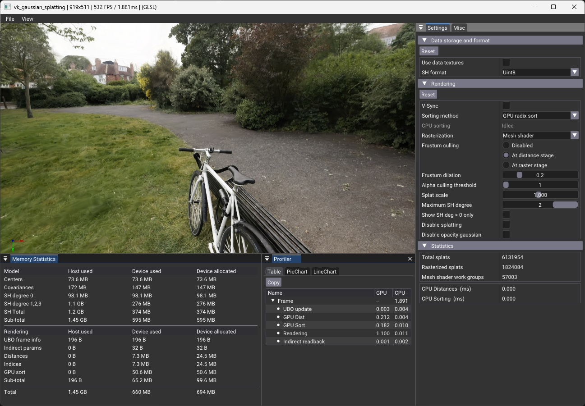
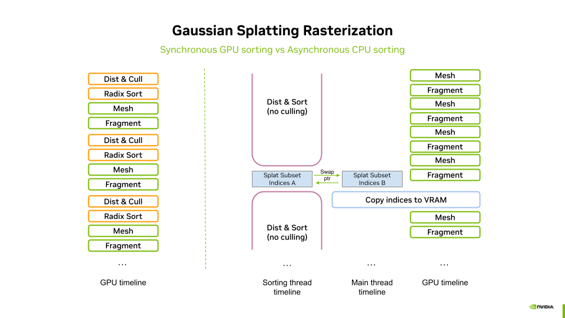
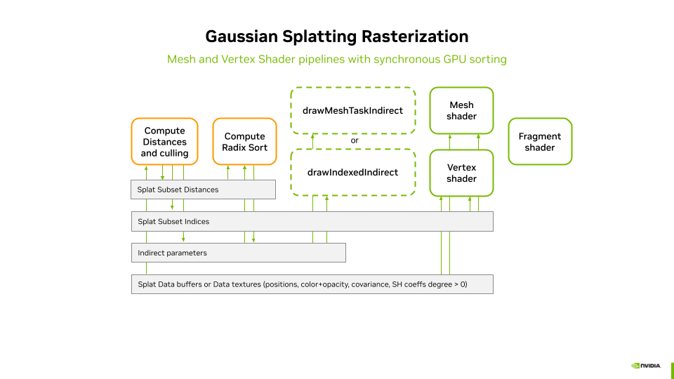
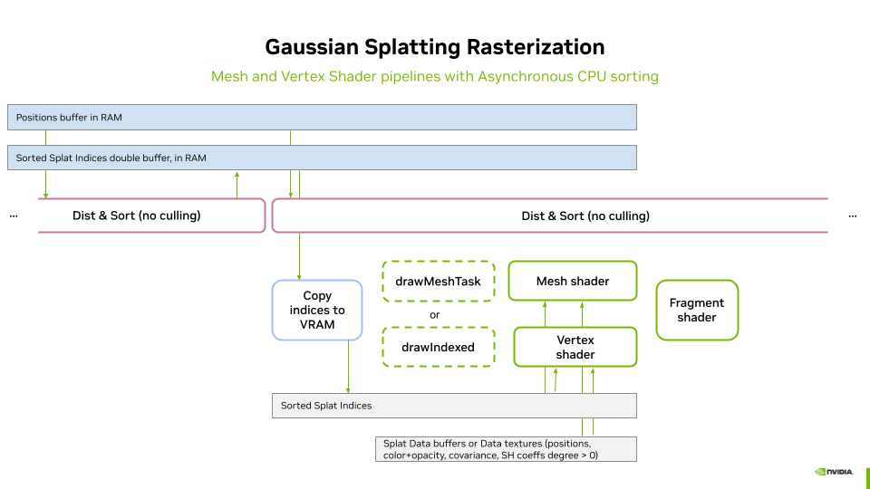

# Vulkan Gaussian Splatting


This repository provides an implementation of **3D Gaussian Splatting (3DGS) [[Kerbl2023](https://repo-sam.inria.fr/fungraph/3d-gaussian-splatting/)] rasterization** using the **Vulkan 1.3 API** for the purpose of real-time visualization. It demonstrates two approaches for rendering splats: one leveraging **mesh shaders** and another utilizing **vertex shaders**. Since Gaussian splats require back-to-front sorting for correct alpha compositing, we present two alternative sorting methods: a **GPU-based Radix Sort** implemented in a compute pipeline, and a **CPU-based asynchronous sorting** strategy using multi threaded sort function from the c++ STL. This project serves as a reference for efficient 3D Gaussian rendering with Vulkan, showcasing **modern shader techniques** and **optimized sorting strategies**.

We envision this project as a laboratory for exploring and comparing different approaches to 3D Gaussian Splatting. By evaluating various techniques and optimizations, we aim to provide valuable insights into performance, quality, and implementation trade-offs. Future work includes, for instance, the implementation of ray tracing for 3DGS [Moënne-Loccoz2024] using the Vulkan Ray Tracing API, or other rasterizations approaches such as Stop The Pop [Radl2024] and  Sort-free 3DGS [Hou2024].

## Building and Running

``` sh
# Clone the repository
git clone https://github.com/nvpro-samples/vk_gaussian_splatting
cd vk_gaussian_splatting

# Configure and build
cmake -S . -B build
cmake --build build --config Release

# Running, if nvprocore was not found in parent directory, 
# it was automatically downloaded by cmake at config
./bin_x64/Release/vk_gaussian_splatting.exe [path_to_ply]

# Running, if nvprocore was found in parent directory
../bin_x64/Release/vk_gaussian_splatting.exe [path_to_ply]

```

## Opening 3DGS Files

The sample application supports PLY files in the format defined by INRIA [[Kerbl2023](https://repo-sam.inria.fr/fungraph/3d-gaussian-splatting/)]. The INRIA dataset of pre-trained models can be downloaded [here](https://repo-sam.inria.fr/fungraph/3d-gaussian-splatting/datasets/pretrained/models.zip).

Supported Files
*	To visualize 3DGS reconstruction output, open PLY files located in the point_cloud subfolders, corresponding to 7,000 or 30,000 iterations.
*	Attention: The input.ply files cannot be loaded, as they represent raw point clouds generated by Structure From Motion (SfM) during model reconstruction.

Files can be opened using any of the following methods:
*	**Command Line** – Provide the file path as an argument when launching the application.
*	**File Menu** – Use File > Open to browse and load a PLY file.
*	**Drag and Drop** – Simply drag the PLY file into the viewport.

Compatibility
*	[Jawset Postshot](https://www.jawset.com/) output files are compatible with the INRIA format and can be opened directly.
*	Other reconstruction softwares outputs may work but have not been tested.

## Sample usage

The visualization workflow follows these main steps:

1. Loading the 3DGS Model into RAM.
2. Data Transformation & Upload – The splat attributes (positions, opacity, Spherical Harmonic (SH) coefficients from degree 0 to 3, and rotation scale) are transformed if necessary and uploaded into VRAM. The data storage and format can be updated during the course of the visualization, tha data in VRAM and the pipelines are then regenerated.
3. Sorting –
    *    At every frame or whenever the viewpoint changes (depending on user settings and sorting method), the splats are sorted back-to-front for correct alpha compositing.
    *    The resulting sorted indices are passed to the rasterization stage.
4. Rasterization –
    *    For each new frame, the sorted splats are rasterized using either the Mesh Shader Pipeline or the Vertex Shader Pipeline, depending on the selected rasterization mode.

This structured workflow ensures efficient rendering while allowing different sorting and rasterization strategies to be compared.



### Data Format and Storage 

The Data Format and Storage Panel allows users to configure how the model's data is stored in VRAM.
*	Data Storage – Selects between **Data Buffers** and **Textures** for storing model attributes, including:
    *	Position
    *	Color and Opacity (deduced from SH degree 0 at construction)
    *	Covariance Matrix
    *	Spherical Harmonics (SH) Coefficients (for degrees higher than 0)

This option impacts memory access patterns and performance, allowing comparisons between different storage strategies. In both modes, splat attributes are stored linearly in memory in the order they are loaded from disk.
*	**Data Buffer Mode** – Uses a separate buffer for each attribute type.
    *	This layout improves memory lookups during shader execution, as threads access attributes in sequential stages (e.g., first positions, then colors, etc.).
    *  	Buffers are allocated and initialized by the [initDataBuffers](src/gaussian_splatting.cpp#L809) method.
*	**Texture Mode** – Uses a separate texture map for each attribute type.
    *	All textures are 4092 pixels wide, with the height determined as a power of two based on the attribute's memory footprint.
    *	Linear storage in textures is suboptimal due to square-based cache for texel fetches, but data locality cannot be easily optimized as sorting is view-dependent.
    *	Future work could explore organizing data based on value proximity to leverage texture compression.
    *   Textures are allocated and initialized by the [initDataTextures](src/gaussian_splatting.cpp#L1110) method.

This flexibility enables performance comparisons between buffer-based and texture-based data storage, each with trade-offs in memory access efficiency and potential optimization opportunities.

### Sorting and Rendering 

The Rendering Panel provides controls to fine-tune the rendering process. Users can adjust the following parameters:
*	**V-Sync** – Toggles vertical synchronization on or off. Disabling V-Sync is recommended when benchmarking to obtain accurate performance measurements in the Profiler Panel.
*	**Sorting Method** – Chooses between GPU-based radix sort or CPU-based asynchronous sorting.
*	**Pipeline** – Selects the rendering pipeline, either Mesh Shader or Vertex Shader.
*	**Frustum Culling** – Defines where frustum culling is performed: in the distance compute shader, vertex shader, or mesh shader. Culling can also be disabled for performance comparisons.
*	**Splat Scale** – Adjusts the size of the splats for visualization purposes.
*	**Spherical Harmonics Degree** – Sets the degree of Spherical Harmonics (SH) used for view-dependent effects:
    *	0: Disables per splat view dependence of color. Uses SH of degree 0 only.
    *	1 to 3: Enables SH of increasing degrees for improved view-dependent rendering.
*	**Show SH Only** – Removes the base color from SH degree 0, applying only color deduced from higher-degree SH to a neutral gray. This helps visualize their contribution.
*	**Disable Splatting** – Switches to point cloud mode, displaying only the splat centers. Other parameters still apply in this mode.
*	**Disable Opacity Gaussian** – Disables the alpha component of the Gaussians, making their full range visible. This helps analyze splat distribution and scales, especially when combined with Splat Scale adjustments.

## Sorting methods



### Synchronous sorting on the GPU

WIP

Two steps, one compute shader computes distances as integers and performs culling (optional at this stage - default mode), use of VRDX third party library to sort the indices using integer distances as key.

Notes on dist quantization compare with Vkgs.

### Asynchronous sorting on the CPU

WIP

Use of parallel for loop to compute floating point distances.
Use of c++ STL multi-core sort to sort the indices according to the distances.
Attention only works on Windows, fall back to  mono-core on Linux and other.

Processing slow in comparison to GPU sort, hence the need for asynchronous processing. Leads to visible popping artefacts but tolerable for lower end devices where full CPU and GPU workload can be leveraged.

No possible culling at this stage since sorting is asynchronous. Would lead to very strong visual artifacts (missing splats) on camera movement since sorting spans over several frames.

## The rendering pipelines






## Benchmarking

``` sh

# Running the benchmark defined in benchmark.txt 
mkdir _benchmark
cd _benchmark
../bin_x64/Release/vk_gaussian_splatting.exe -benchmark ../benchmark.txt <path_to_3dgs_dataset>/bicycle/point_cloud/iteration_30000/point_cloud.ply

```

## Profiling with NSight

Note for me: Would be interesting with screen shots. But can we compare two pipeline isnce it deos use sample timeline and not time based ?

## References

[[Kerbl2023](https://repo-sam.inria.fr/fungraph/3d-gaussian-splatting/)] 3D Gaussian Splatting for Real-Time Radiance Field Rendering. Kerbl, B., Kopanas, G., Leimkuehler, T., & Drettakis, G. (2023). ACM Transactions on Graphics (TOG), 42, 1 - 14.

[[Radl2024](https://r4dl.github.io/StopThePop/)] Radl, L., Steiner, M., Parger, M., Weinrauch, A., Kerbl, B., & Steinberger, M. (2024). StopThePop: Sorted Gaussian Splatting for View-Consistent Real-time Rendering. ACM Trans. Graph., 43, 64:1-64:17.

[[Moënne-Loccoz2024](https://gaussiantracer.github.io/)] 3D Gaussian Ray Tracing: Fast Tracing of Particle Scenes. Moënne-Loccoz, N., Mirzaei, A., Perel, O., Lutio, R.D., Esturo, J.M., State, G., Fidler, S., Sharp, N., & Gojcic, Z. (2024).  ACM Trans. Graph., 43, 232:1-232:19.

[[Hou2024](https://arxiv.org/abs/2410.18931)] Sort-free Gaussian Splatting via Weighted Sum Rendering. Hou, Q., Rauwendaal, R., Li, Z., Le, H., Farhadzadeh, F., Porikli, F.M., Bourd, A., & Said, A. (2024). ArXiv, abs/2410.18931.

## 3rd party licences

## License

Apache-2.0

