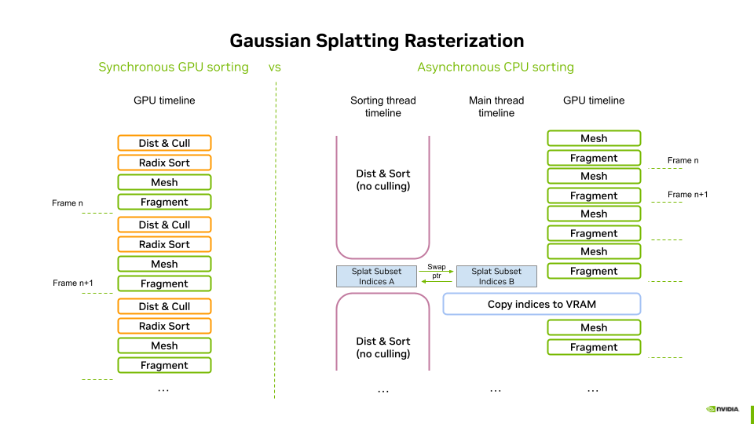

# Vulkan Gaussian Splatting

This repository provides an implementation of **3D Gaussian Splat rasterization** using the **Vulkan 1.3 API**. It demonstrates two approaches for rendering splats: one leveraging **mesh shaders** and another utilizing **vertex shaders**. Since Gaussian splats require back-to-front sorting for correct alpha compositing, we present two alternative sorting methods: a **GPU-based approach** using a **Radix Sort** implemented in a compute pipeline, and a **CPU-based asynchronous sorting** strategy using multi threaded sorting from the c++ STL. This project serves as a reference for efficient 3D Gaussian rendering with Vulkan, showcasing modern shader techniques and optimized sorting strategies.

## Building and Running

``` sh
# Clone the repository
git clone https://github.com/nvpro-samples/vk_gaussian_splatting
cd vk_gaussian_splatting

# Configure and build
cmake -S . -B build
cmake --build build --config Release

# Running, if nvprocore was not found in parent directory, 
# it was automatically downloaded by cmake at config
./bin_x64/Release/vk_gaussian_splatting.exe [path_to_ply]

# Running, if nvprocore was found in parent directory
../bin_x64/Release/vk_gaussian_splatting.exe [path_to_ply]

```

## Opening 3DGS Files

The sample application supports PLY files in the format defined by INRIA ([Citation]). The INRIA dataset can be downloaded at [URL].

Supported Files
*	The input.ply files cannot be loaded, as they represent raw point clouds generated by Structure From Motion (SfM) during model reconstruction.
*	To visualize the final output, open PLY files located in the point_cloud subfolders, corresponding to 7,000 or 30,000 iterations.

Files can be opened using any of the following methods:
*	**Command Line** – Provide the file path as an argument when launching the application.
*	**File Menu** – Use File > Open to browse and load a PLY file.
*	**Drag and Drop** – Simply drag the PLY file into the viewport.

Compatibility
*	Jawset Postshot ([link]) output files are compatible with the INRIA format and can be opened directly.
*	Other reconstruction software may work but has not been tested.

## User interface

### Rendering Panel

The Rendering Panel provides controls to fine-tune the rendering process. Users can adjust the following parameters:
*	**V-Sync** – Toggles vertical synchronization on or off. Disabling V-Sync is recommended when benchmarking to obtain accurate performance measurements in the Profiler Panel.
*	**Pipeline** – Selects the rendering pipeline, either Mesh Shader or Vertex Shader.
*	**Sorting Method** – Chooses between GPU-based radix sort or CPU-based asynchronous sorting.
*	**Frustum Culling** – Defines where frustum culling is performed: in the distance shader (GPU), vertex shader, or mesh shader. Culling can also be disabled for performance comparisons.
*	**Splat Scale** – Adjusts the size of the splats for visualization purposes.
*	**Spherical Harmonics Degree** – Sets the degree of Spherical Harmonics (SH) used for view-dependent effects:
    *	0: Disables view dependence.
    *	1 to 3: Enables SH of increasing degrees for improved view-dependent rendering.
*	**Show SH Only** – Removes the base color from SH degree 0, applying only color deduced from higher-degree SH to a neutral gray. This helps visualize their contribution.
*	**Disable Splatting** – Switches to point cloud mode, displaying only the splat centers. Other parameters still apply in this mode.
*	**Disable Opacity Gaussian** – Disables the alpha component of the Gaussians, making their full range visible. This helps analyze splat distribution and scales, especially when combined with Splat Scale adjustments.

### Data Format and Storage Panel

The Data Format and Storage Panel allows users to configure how the model's data is stored in VRAM.
*	Data Storage – Selects between **Uniform Data Buffers** and **Textures** for storing model attributes, including:
    *	Position
    *	Color and Opacity (deduced from SH degree 0 at construction)
    *	Covariance Matrix
    *	Spherical Harmonics (SH) Coefficients (for degrees higher than 0)

This option impacts memory access patterns and performance, allowing comparisons between different storage strategies.

The Data Format and Storage Panel allows users to configure how the model's attributes are stored in VRAM, either using Uniform Data Buffers or Textures. In both modes, splat attributes are stored linearly in memory in the order they are loaded from disk.
*	**Data Buffer Mode** – Uses a separate buffer for each attribute type.
    *	This layout improves memory lookups during shader execution, as threads access attributes in sequential stages (e.g., first positions, then colors, etc.).
    *  	Buffers are allocated and initialized by the [initDataBuffers](src/gaussian_splatting.cpp#L809) method.
*	**Texture Mode** – Uses a separate texture map for each attribute type.
    *	All textures are 4092 pixels wide, with the height determined as a power of two based on the attribute's memory footprint.
    *	Linear storage in textures is suboptimal due to square-based cache for texel fetches, but data locality cannot be easily optimized as sorting is view-dependent.
    *	Future work could explore organizing data based on value proximity to leverage texture compression.
    *   Textures are allocated and initialized by the [initDataTextures](src/gaussian_splatting.cpp#L1110) method.

This flexibility enables performance comparisons between buffer-based and texture-based data storage, each with trade-offs in memory access efficiency and potential optimization opportunities.


## The pipelines


## Sorting methods




## Building and Running

``` sh

# Running the benchmark defined in benchmark.txt 
mkdir _benchmark
cd _benchmark
../bin_x64/Release/vk_gaussian_splatting.exe -benchmark ../benchmark.txt <path_to_3dgs_dataset>/bicycle/point_cloud/iteration_30000/point_cloud.ply

```

## Refrences

## 3rd party licences

## License
Apache-2.0

