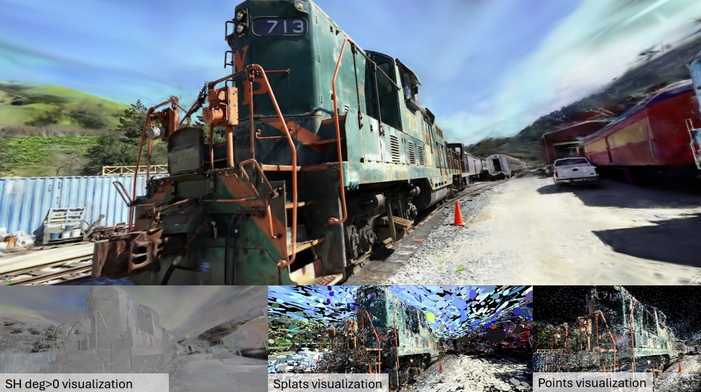
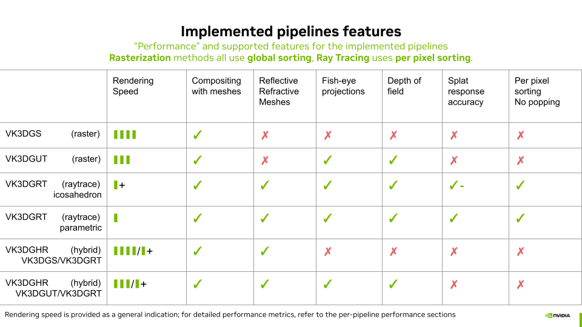

# Vulkan Gaussian Splatting

[](LICENSE)



We envision this project as a **testbed** to explore and compare various approaches to real-time visualization of **3D Gaussian Splatting (3DGS) [[Kerbl2023](https://repo-sam.inria.fr/fungraph/3d-gaussian-splatting/)]** and related evolutions. By evaluating various techniques and optimizations, we aim to provide valuable insights into **performance, quality, and implementation trade-offs** when using the **Vulkan API**.

This sample implements several **rendering pipelines** based on **rasterization**, **ray tracing**, and **hybrid** approaches. For a good general understanding, we strongly recommend reading the following pages in order.

1. The present **readme.md**, will get you **up and running** with the software, point out where to **get sample scenes** and how to **open your first scene**. It also centralizes the bibliographic references for all the sub pages.
2. The [Vulkan Gaussian Splatting Overview](./doc/overview_of_vk_gaussian_splatting.md) page will drive you through the different elements of the user interface and the functionalities of the software. *Some important points are introduced in this page*.

    We then describe our Vulkan implementation of the rendering approaches:
3. [VK3DGSR: 3D Gaussian Splatting (3DGS) [Kerbl2023] using Vulkan Rasterization](./doc/rasterization_of_3d_gaussian_splatting.md)
4. [VK3DGRT: 3D Gaussian Ray Tracing (3DGRT) [Moënne-Loccoz2024] using Vulkan RTX](./doc/ray_tracing_3d_gaussians.md)
5. 🔥[VK3DGUT: 3D Gaussian Unscented Transform (3DGUT) [Wu2024] Using Vulkan Rasterization](./doc/rasterization_of_3dgut.md) 
6. 🔥[VK3DGHR: 3D Gaussian Hybrid Rendering Using Vulkan RTX and Rasterization](./doc/hybrid_rendering_3d_gaussians.md)




## News

- [2025/10] 🔥Migration from GLSL to SLANG.
- [2025/09] 🔥Added Unscented Transform (3DGUT) and hybrid rendering (3DGUT/3DGRT) pipelines, with support for fisheye and depth of field.
- [2025/09] Added import of .spz file format from [nianticlabs](https://github.com/nianticlabs/spz).
- [2025/08] Added depth of field to raytracing (3DGRT) pipeline.
- [2025/08] Added raytracing (3DGRT) and hybrid rendering (3DGS/3DGRT) pipelines + 3DGRT dataset.
- [2025/08] Added compositing with meshes and project save/load functionality.
- [2025/06] Ported to new NVIDIA DesignWorks [nvpro_core2](https://github.com/nvpro-samples/nvpro_core2).
- [2025/03] Added new models from [3ds-scan.de](https://3ds-scan.de/). Thanks to Christian Rochner.
- [2025/03] First release with 3DGS rasterization.

## Table of Contents

1. [Requirements](#requirements)
2. [Building and Running](#building-and-running)
3. [Opening 3DGS PLY and SPZ Files](#opening-3dgs-ply-and-spz-files)
4. [3DGS Datasets](#3dgs-datasets)
5. [3DGRT Datasets](#3dgrt-datasets)
6. [3DGUT Datasets](#3dgut-datasets)
7. [Profiling and Benchmarking](#profiling-and-benchmarking)
8. [Continue Reading](#continue-reading)
9. [References](#references)
10. [3rd-Party Licenses](#3rd-party-licenses)
11. [License](#license)
12. [Contributing](#contributing)
13. [Support](#support)

## Requirements

- 64-bit Windows or Linux
- [Vulkan 1.4 SDK](https://vulkan.lunarg.com/sdk/home)  
- [CMake 3.22 or higher](https://cmake.org/download/)
- Compiler supporting basic C++20 features
  - MSVC 2019 on Windows
  - GCC 10.5 or Clang on Linux
- Additional Libraries on Linux
    - `sudo apt install libx11-dev libxcb1-dev libxcb-keysyms1-dev libxcursor-dev libxi-dev libxinerama-dev libxrandr-dev libxxf86vm-dev libtbb-dev`
- [CUDA v12.6](https://developer.nvidia.com/cuda-downloads) is **optional** and can be used to activate **NVML GPU monitoring** in the sample. 
- NVIDIA DesignWorks [nvpro_core2](https://github.com/nvpro-samples/nvpro_core2) will be automatically downloaded if not found next to the sample directory.

## Building and Running

``` sh
# Clone the repository (use --recursive instead for git verison < 2.13)
git clone --recurse-submodules https://github.com/nvpro-samples/vk_gaussian_splatting
cd vk_gaussian_splatting

# Configure 
cmake -S . -B build

# Alternatively, configure as follows to disable the default "bouquet of flowers"  
# scene download by CMake and prevent auto-loading in the sample
cmake -S . -B build -DDISABLE_DEFAULT_SCENE=ON

# Build
cmake --build build --config Release

# Run
./_bin/Release/vk_gaussian_splatting.exe [path_to_ply]

```

## Opening 3DGS PLY and SPZ Files

By default the application opens a 3DGS model representing a bouquet of flowers unless you disabled it at CMake stage. The sample application supports PLY files in the format introduced by INRIA [[Kerbl2023](https://repo-sam.inria.fr/fungraph/3d-gaussian-splatting/)]. The sample also supports import of SPZ files as defined by [nianticlabs](https://github.com/nianticlabs/spz). PLY and SPZ files can be opened using any of the following methods:
* **Command Line** – Provide the file path as last argument when launching the application.
* **File Menu** – Use "File > Open" to browse and load a PLY or SPZ file.
* **Drag and Drop** – Simply drag and drop the PLY or SPZ file into the viewport.

**Compatibility**
* [Jawset Postshot](https://www.jawset.com/) and [3DGRUT](https://github.com/nv-tlabs/3dgrut) output ply files are compatible with the INRIA format and can be opened directly.
* Other reconstruction software's ply outputs such as [NerfStudio](https://docs.nerf.studio/nerfology/methods/splat.html), [LichtFeld Studio](https://github.com/MrNeRF/LichtFeld-Studio) should also work.

* SPZ file import can be tested using the sample [models](https://github.com/nianticlabs/spz/tree/main/samples) provided by nianticlabs.

> **Important Note**: Visualization of 3D Gaussian models is most effective when using the same rendering algorithm and settings used during reconstruction. For example, models generated using Postshot 3DGS with anti-aliasing enabled will be best visualized using one of the available 3DGS pipelines (Mesh or Vertex) and by enabling "Mip Splatting Anti-Aliasing" in the rendering > rasterization parameters. Since no generic format with proper metadata exists, users must manually configure the rendering settings. Note that original 3DGS models from INRIA do not include anti-aliasing, which was introduced later [Yu2023].

## 3DGS Datasets

The INRIA dataset of pre-trained models is available for [download](https://repo-sam.inria.fr/fungraph/3d-gaussian-splatting/datasets/pretrained/models.zip) from the INRIA server. 

* To visualize 3DGS reconstruction output, **open PLY files located in the point_cloud subfolders**, corresponding to 7,000 or 30,000 iterations.
* Attention: The **input.ply files cannot be loaded**, as they represent raw point clouds (not 3DGS) generated by Structure From Motion (SfM) during model reconstruction.

Additionally, you can download the [3D gaussian model of a place with a fountain in France](http://developer.download.nvidia.com/ProGraphics/nvpro-samples/fountain_place.zip) and [the 3DGS model of fountain Sindelfingen](http://developer.download.nvidia.com/ProGraphics/nvpro-samples/fountain_sindelfingen.zip), both by [3ds-scan (Christian Rochner)](https://3ds-scan.de/) and licensed under the [CC BY-SA 4.0](https://creativecommons.org/licenses/by-sa/4.0/) license.

The Bouquet of Flowers scene, which is automatically downloaded by CMake, can also be [downloaded here](http://developer.download.nvidia.com/ProGraphics/nvpro-samples/flowers_1.zip). The model is released under the [CC BY-SA 4.0](https://creativecommons.org/licenses/by-sa/4.0/) license.

Note: Even if not generated by 3DGRT or 3DGUT, the 3DGS bouquet of flowers and the two 3DGS fountain scenes from 3ds-scan will provide acceptable visual results when rendered using 3DGRT or 3DGUT with **Kernel degree** set to "2 (Quadratic)."

## 3DGRT Datasets

> **Attention**: The original version of the archive, named 3dgrt-mipnerf360-parametric-1M-v1.zip, was erroneously containing 3DGUT models. The archive has been renamed and updated with proper 3DGRT content.

We provide the reconstruction of the MipNerf 360 image set v1, using **3DGRT** with parametric particles intersections and MCCM/Adam, providing 1M splats for each model.

Download: [3dgrt-mipnerf360-v1-parametric-degree-4-mcmc-selective-adam-1M (1.5GB)](http://developer.download.nvidia.com/ProGraphics/nvpro-samples/3dgrt-mipnerf360-v1-parametric-degree-4-mcmc-selective-adam-1M.zip). 

Recommended visualization settings for the **3DGRT pipeline**:
* **Kernel degree**: 4 (Tesseractic)
* **Particle format**: AABB + parametric  

## 3DGUT Datasets

We provide the reconstruction of the MipNerf 360 image set v1, using **3DGUT** with MCCM/Adam, providing 1M splats for each model.

Download: [3dgut-mipnerf360-v1-mcmc-selective-adam-1M (1.5GB)](http://developer.download.nvidia.com/ProGraphics/nvpro-samples/3dgut-mipnerf360-v1-mcmc-selective-adam-1M.zip). 

Recommended visualization settings for the **3DGUT or hybrid 3DGUT+3DGRT pipelines**:
* **Mip splatting anti-aliasing**: Enabled  
* **Kernel degree**: 2 (Quadratic)  

## Profiling and Benchmarking

To properly assess the performance of the pipelines, you should **deactivate vertical synchronization (V-Sync)**. This can be done from the **View > V-Sync** menu, the **Renderer Properties** panel, or the **Profiler** window. If V-Sync is not deactivated, the system does not run at optimal performance, and the reported timings in the **Window Top Bar** and **Profiler** window are generally higher (and fps lower) than the achievable performance. The V-Sync option is enabled by default to save energy.

The system also provides a means to run automatic benchmarks, which are detailed in the **Performance Results** sections of the documentation sub-pages. In Benchmarking mode, V-Sync is automatically disabled.

## Continue Reading

1. [Vulkan Gaussian Splatting Overview](./doc/overview_of_vk_gaussian_splatting.md) 
2. [VK3DGSR: 3D Gaussian Splatting (3DGS) [Kerbl2023] using Vulkan Rasterization](./doc/rasterization_of_3d_gaussian_splatting.md)
3. [VK3DGRT: 3D Gaussian Ray Tracing (3DGRT) [Moënne-Loccoz2024] using Vulkan RTX](./doc/ray_tracing_3d_gaussians.md)
4. [VK3DGUT: 3D Gaussian Unscented Transform (3DGUT) [Wu2024] Using Vulkan Rasterization](./doc/rasterization_of_3dgut.md)
5. [VK3DGHR: 3D Gaussian Hybrid Rendering Using Vulkan RTX and Rasterization](./doc/hybrid_rendering_3d_gaussians.md)

## References

[[Zwicker2002](https://www.cs.umd.edu/~zwicker/publications/EWASplatting-TVCG02.pdf)]. **EWA Splatting**. E., Zwicker, M., Pfister, H., Van Baar, J., Gross, M.H., Zwicker, M., Pfister, H., Van Baar, J., & Gross, M.H. (2002). IEEE Transactions on Visualization and Computer Graphics.

[[Kerbl2023](https://repo-sam.inria.fr/fungraph/3d-gaussian-splatting/)] **3D Gaussian Splatting for Real-Time Radiance Field Rendering**. Kerbl, B., Kopanas, G., Leimkuehler, T., & Drettakis, G. (2023). ACM Transactions on Graphics (TOG), 42, 1 - 14.

[[Yu2023](https://niujinshuchong.github.io/mip-splatting/)] **Mip-Splatting: Alias-Free 3D Gaussian Splatting.**. Yu, Z., Chen, A., Huang, B., Sattler, T., & Geiger, A. (2023).  2024 IEEE/CVF Conference on Computer Vision and Pattern Recognition (CVPR), 19447-19456.

[[Radl2024](https://r4dl.github.io/StopThePop/)] **StopThePop: Sorted Gaussian Splatting for View-Consistent Real-time Rendering**. Radl, L., Steiner, M., Parger, M., Weinrauch, A., Kerbl, B., & Steinberger, M. (2024). ACM Trans. Graph., 43, 64:1-64:17.

[[Moënne-Loccoz2024](https://gaussiantracer.github.io/)] **3D Gaussian Ray Tracing: Fast Tracing of Particle Scenes**. Moënne-Loccoz, N., Mirzaei, A., Perel, O., Lutio, R.D., Esturo, J.M., State, G., Fidler, S., Sharp, N., & Gojcic, Z. (2024).  ACM Trans. Graph., 43, 232:1-232:19.

[[Hou2024](https://arxiv.org/abs/2410.18931)] **Sort-free Gaussian Splatting via Weighted Sum Rendering**. Hou, Q., Rauwendaal, R., Li, Z., Le, H., Farhadzadeh, F., Porikli, F.M., Bourd, A., & Said, A. (2024). ArXiv, abs/2410.18931.

[[Morgenstern2024](https://fraunhoferhhi.github.io/Self-Organizing-Gaussians/)] **Compact 3D Scene Representation via Self-Organizing Gaussian Grids**. Wieland Morgenstern, Florian Barthel, Anna Hilsmann, Peter Eisert. ECCV 2024.

[[Wu2024](https://research.nvidia.com/labs/toronto-ai/3DGUT/)] **3DGUT: Enabling Distorted Cameras and Secondary Rays in Gaussian Splatting**. Wu, Q., Esturo, J.M., Mirzaei, A., Moënne-Loccoz, N., & Gojcic, Z. (2024). ArXiv, abs/2412.12507. CVPR 2025.

[[3DGRUT](https://github.com/nv-tlabs/3dgrut)] This repository provides the official implementations of 3D Gaussian Ray Tracing (3DGRT)[Moënne-Loccoz2024] and 3D Gaussian Unscented Transform (3DGUT)[Wu2024]. 

## 3rd-Party Licenses

| Library | URL | License |
|--------------|---------|--|
| **miniply** | https://github.com/vilya/miniply | [MIT](https://github.com/vilya/miniply/blob/master/LICENSE.md) |
| **vrdx** | https://github.com/jaesung-cs/vulkan_radix_sort | [MIT](https://github.com/jaesung-cs/vulkan_radix_sort/blob/master/LICENSE) |
| **spz** | https://github.com/nianticlabs/spz | [MIT](https://github.com/nianticlabs/spz?tab=MIT-1-ov-file#readme) |

Some parts of the current implementation are strongly inspired by, and in some cases incorporate, source code and comments from the following third-party projects:

| Project | URL | License |
|--------------|---------|--|
| **vkgs** | https://github.com/jaesung-cs/vkgs | [MIT](https://github.com/jaesung-cs/vkgs/blob/master/LICENSE) |
| **GaussianSplats3D** | https://github.com/mkkellogg/GaussianSplats3D | [MIT](https://github.com/mkkellogg/GaussianSplats3D/blob/main/LICENSE) |


Additional 3rd-Party sofwtares are listed in [nvpro_core2/third_party](https://gitlab-master.nvidia.com/devtechproviz/nvpro-samples/nvpro_core2/-/tree/main/third_party).

## License

[](LICENSE)

## Contributing

Merge requests to vk_gaussian_splatting are welcome, and use the Developer Certificate of Origin (https://developercertificate.org included in [CONTRIBUTING](CONTRIBUTING)).

When committing, please certify that your contribution adheres to the DCO and use `git commit --sign-off`. Thank you!

## Support

- For bug reports and feature requests, please use the [GitHub Issues](https://github.com/nvpro-samples/vk_gaussian_splatting/issues) page.
- For general questions and discussions, please use the [GitHub Discussions](https://github.com/nvpro-samples/vk_gaussian_splatting/discussions) page.
