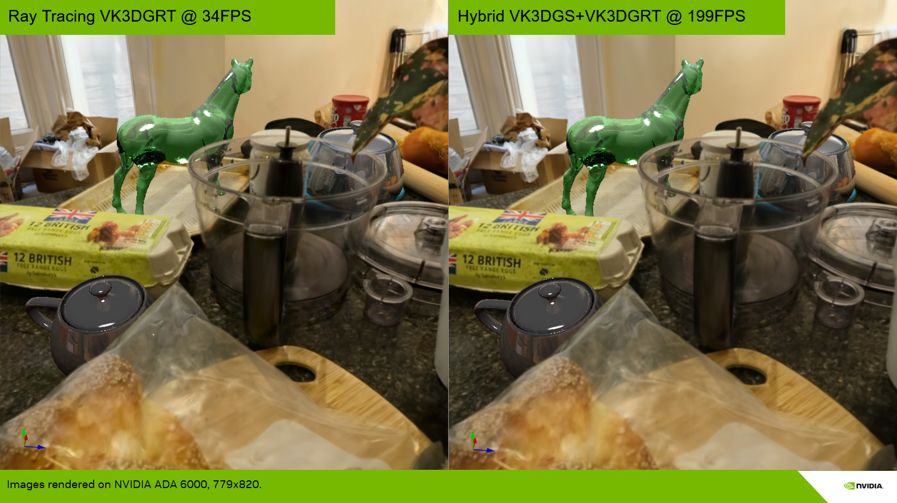
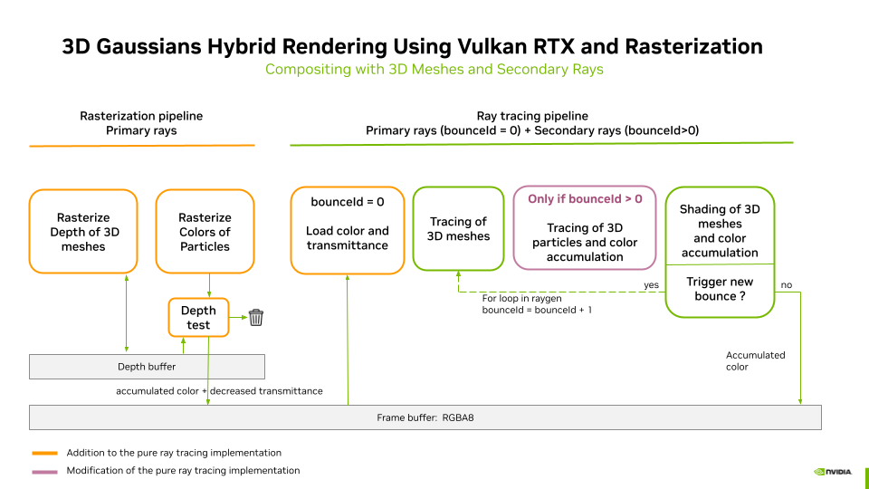

# VK3DGHR: Efficient 3D Gaussians Hybrid Rendering Using Vulkan RTX and Rasterization

 

3D Gaussians can be raytraced (3DGRT/VK3DGRT) for advanced light interactions with 3D synthetic geometries and various camera models, such as fisheye lenses and rolling shutters. However, the per-ray sorting it introduces results in a significant performance cost.

To overcome this problem, 3DGUT [Wu2024] introduces the use of the **Unscented Transform** to replace EWA splatting in the original 3DGS pipeline, enabling the fast rasterization of 3DGS to be extended to distorted cameras for primary rays, and become coherent with the 3DGRT model, which can then be used for secondary rays.

In the present implementation we do not yet support the Unscented Transform. However, we have implemented the **hybrid pipeline** that allows the use of 3DGS rasterization (VK3DGSR) for primary rays and ray tracing (VK3DGRT) for secondary rays. This enables reflection and refraction of 3D Gaussians on/through 3D meshes. Mixing these two modes massively increases the overall rendering performance of such composed scenes.

The **Compositing with 3D Meshes and Secondary Rays** detailed in [VK3DGRT](./ray_tracing_3d_gaussians.md#) is then updated as follows:

> **Note**: Using the hybrid mode, even though the **Unscented Transform** version is not yet available, it is preferable to use models reconstructed using 3DGRT/3DGUT rather than 3DGS for the best visual results.

## References

Please consult the consolidated [References](../readme.md#References) section of the main `readme.md`.
