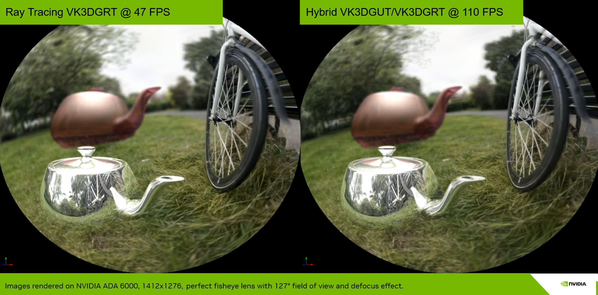
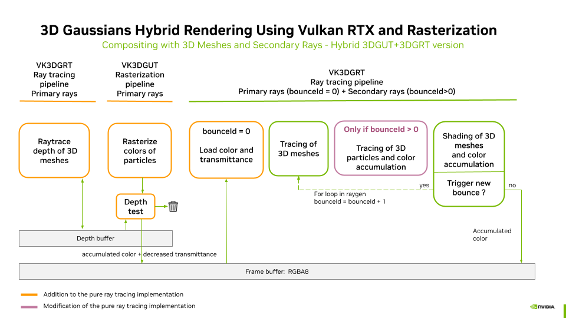
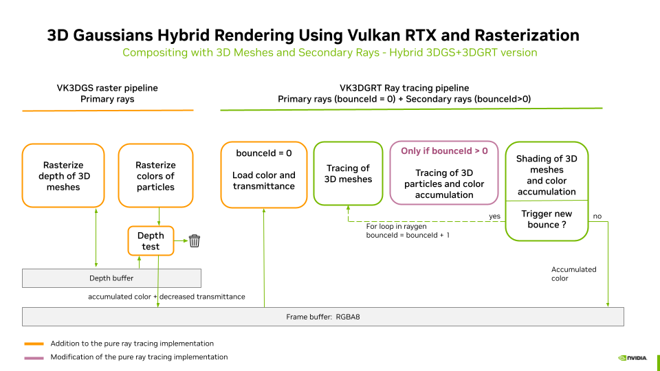

# VK3DGHR: Efficient 3D Gaussians Hybrid Rendering Using Vulkan RTX and Rasterization

3D Gaussians can be raytraced (3DGRT/VK3DGRT)) for advanced light interactions with 3D synthetic geometries and various camera models featuring fisheye lenses and rolling shutters. However, the per-ray sorting it introduces results in a significant performance cost.

To overcome this problem, 3DGUT [Wu2024] introduces the use of the **Unscented Transform** to replace EWA splatting in the original 3DGS pipeline enabling the fast rasterization of 3DGS to be extended to distorted cameras for primary rays and become coherent with the 3DGRT model, which can then be used for secondary rays.

We have implemented two hybrid pipelines, **Hybrid 3DGUT/3DGRT** and **Hybrid 3DGS/3DGRT**, allowing the use of 3DGUT rasterization ([VK3DGUT](./rasterization_of_3dgut.md)) and 3DGS rasterization ([VK3DGS](./rasterization_of_3d_gaussian_splatting.md)) for primary rays with ray tracing ([VK3DGRT](./ray_tracing_3d_gaussians.md)) for secondary rays. 

Both pipelines enable reflection and refraction of 3D Gaussians on/through 3D meshes. Mixing rasterization with raytracing massively increases the overall rendering performance of such composed scenes. Finally, **Hybrid 3DGUT/3DGRT** allows for fisheye lenses and depth of field effects.

## Hybrid Rendering with 3DGUT and 3DGRT

The **Compositing with 3D Meshes and Secondary Rays** detailed in [VK3DGRT](./ray_tracing_3d_gaussians.md#) is updated as follows. The pre-pass that computes the depth of the 3D meshes is performed by the VK3DGRT pipeline to get coherent fisheye distortions and depth-of-field effects when activated. This pre-pass only computes the depth of the 3D mesh for the primary rays and skips all its other processes (it could be a dedicated pipeline; we reused the same one for simplicity). This pre-pass is used to prevent occluded particles from being rendered by the VK3DGUT rasterization. During the second invocation of the VK3DGRT pipeline, the color and transmittance resulting from the rasterization of the 3D particles are loaded to initialize 3DGRT. Everything is then rendered as in standalone 3DGRT except the 3D particles during the first bounce.

## Hybrid Rendering with 3DGS and 3DGRT

 

This version uses full rasterization for the primary rays as a variant example. We could also have used the ray tracing approach for the depth computation of the primary rays/mesh intersections. Using ray tracing in the previous pipeline was mandatory but not in the current one since fisheye cameras and depth of field are not supported by 3DGS and are forced deactivated.

## References

Please consult the consolidated [References](../readme.md#References) section of the main `readme.md`.
