# Lighting, Shading and Shadows

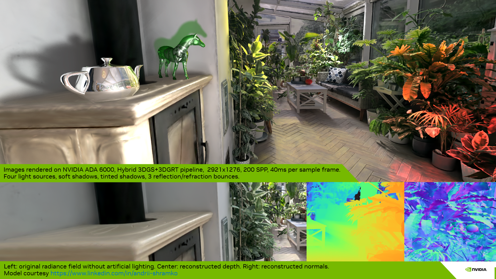

In this page we describe and compare the implementation of lighting and shading for both rasterization and ray tracing pipelines. Shadows are covered in the ray tracing pipeline section. 

What we present here is not a re-lighting approach where, for each particle, material properties are estimated and the original lighting is removed to apply a new one using the reconstructed materials per particle. Instead, we ingest the model with its baked lighting — either in the base color, in the upper SH degrees of the splats, or both. If the model is well defined, it is possible to remove some of the baked lighting by discarding higher SH bands; however, this may also remove anisotropic material information.

In any case, we assign a unique material to each Gaussian particle set (per model). The material is the same as for meshes and is not a PBR (Physically Based Rendering) material yet — it is a standard emissive, ambient, diffuse, specular material. By default, the material is set to fully emissive for all color channels, which means the particle set is used as a radiance field (which it is) that emits its own energy, and no light is needed to visualize the model. 

The user can then tweak the material (**Assets > Splat Set > Material**) — for instance, reduce the emissive component and raise the diffuse component — so that lighting and shading of the model will include the contribution of additional synthetic light sources. The implementation supports point, spot, and directional lights.

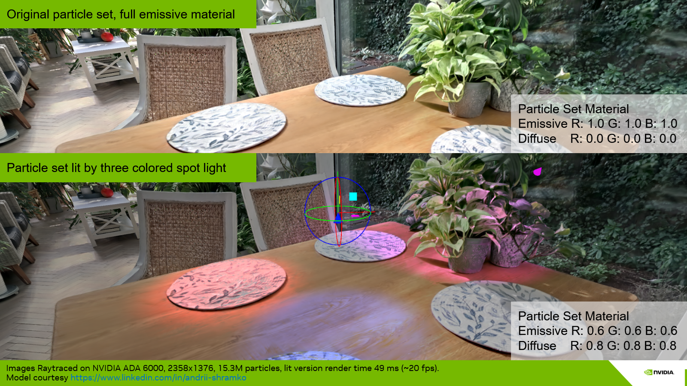

Computing lighting, shading, and shadows requires positional information and normals. These are described in the first two sections, before we present the lighting for the rasterization and ray tracing pipelines.

## Table of Contents

1. [Positional Information and Distance Picking](#1-positional-information-and-distance-picking)
    1. [Distance Picking in Sorted Blending Mode](#11-distance-picking-in-sorted-blending-mode)
    2. [Distance Picking in Stochastic Splat (Raster) and Stochastic Any Hit (Ray Tracing) Modes](#12-distance-picking-in-stochastic-splat-raster-and-stochastic-any-hit-ray-tracing-modes)
    3. [Distance Picking in Stochastic Pass (Ray Tracing) Mode](#13-distance-picking-in-stochastic-pass-ray-tracing-mode)
    4. [Hit Distance for a Single 3D Gaussian Particle](#14-hit-distance-for-a-single-3d-gaussian-particle)
        1. [Ray Tracing Mode](#141-ray-tracing-mode)
        2. [Rasterization Mode](#142-rasterization-mode)
        3. [Comparison of Picked Surface Results](#143-comparison-of-picked-surface-results-depending-on-hit-distance-method)
    5. [Front-to-Back Rasterization](#15-front-to-back-rasterization)
        1. [Vulkan Blend Modes for BTF Rasterization — Baseline](#151-vulkan-blend-modes-for-back-to-front-btf-rasterization--baseline)
        2. [Adaptation of Vulkan Blend Modes for FTB Rasterization](#152-adaptation-of-vulkan-blend-modes-for-front-to-back-ftb-rasterization)
        3. [Three-Pass FTB Rendering for Mesh–Splat Compositing](#153-three-pass-ftb-rendering-for-meshsplat-compositing)
2. [Normal Vector Integration and Picking](#2-normal-vector-integration-and-picking)
    1. [Normal Integration in Sorted Blending Mode](#21-normal-integration-in-sorted-blending-mode)
    2. [Normal Picking in Stochastic Splat (Raster) and Stochastic Any Hit (Ray Tracing) Mode](#22-normal-picking-in-stochastic-splat-raster-and-stochastic-any-hit-ray-tracing-mode)
    3. [Normal Integration in Stochastic Pass (Ray Tracing) Mode](#23-normal-integration-in-stochastic-pass-ray-tracing-mode)
    4. [Normal Vectors of a Single 3D Gaussian Particle](#24-normal-vectors-of-a-single-3d-gaussian-particle)
3. [Lighting and Shading in the Rasterization Pipelines](#3-lighting-and-shading-in-the-rasterization-pipelines)
4. [Lighting, Shadows and Shading in the Ray Tracing Pipeline](#4-lighting-shadows-and-shading-in-the-ray-tracing-pipeline)
5. [Lighting, Shadows and Shading in the Hybrid Pipelines](#5-lighting-shadows-and-shading-in-the-hybrid-pipelines)

## 1. Positional Information and Distance Picking

In order to compute a **surface position** in global coordinates, we use the camera-to-particle distance or the camera-to-iso-surface distance. Depending on the rendering strategy used to integrate radiance — stochastic transparency or sorted blending — the **distance** is either the one to the selected sample in the first case, or picked at an integrated-opacity threshold among all the splats intersected by the ray (ray tracing) or covered by the pixel (rasterization) in the second. The computation of the **distance** for a given ray/pixel and a single particle is described in section [1.4](#14-hit-distance-for-a-single-3d-gaussian-particle). The following subsections describe how the surface distance is determined under each rendering strategy.

### 1.1. Distance Picking in Sorted Blending Mode

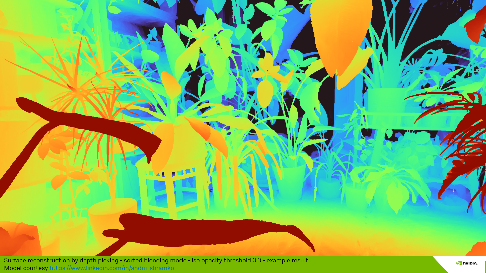

In Sorted Blending mode, we do not treat the particle set as a fully volumetric medium, where lighting — and especially shadows — would need to be computed for each particle and the results integrated. This would lead to very high computational costs in both rasterization and ray tracing pipelines. Instead, we consider that the particle set, even if volumetric, mostly describes surfaces. We thus deduce surface information from the volumetric information (i.e. from the multiple layers of particles), then associate the integrated radiance and normal with this surface to compute the lighting (including shadows).

**What does not work.** It may be tempting to simply integrate the depth as is done for radiance (or normal vectors as described in Section 2). However, even if this leads to "acceptable" results in the rare case of a particle set that is very dense and does not describe multiple separated objects, this solution is fundamentally erroneous. First, weighting a particle distance by its alpha response leads to meaningless weighted distances. Second, integrating (by average or weighted average) the distances of two separate groups of particles would produce a final surface distance sitting anywhere but at the front surface of the closest object. Floaters also introduce significant noise — an invisible floater sitting between a real surface and the viewpoint would again lead to an erroneous integrated distance.

**Iso-opacity surface approach.** The idea is to find a surface where the integrated opacity is uniform. The integrated opacity is simply equal to one minus the integrated transmittance during the **front-to-back** traversal of the splats. The transmittance starts at 1.0 and decreases whenever a splat is hit. As an approximation, during the evaluation of the sorted hits, we pick the distance to the first particle whose evaluation causes the transmittance to drop below a given threshold. This value can be controlled by the **Depth Iso Threshold** parameter, available in both the rasterization panel and the ray tracing panel. These are two separate values, since the two rendering approaches may lead to different per-particle hit distances. 

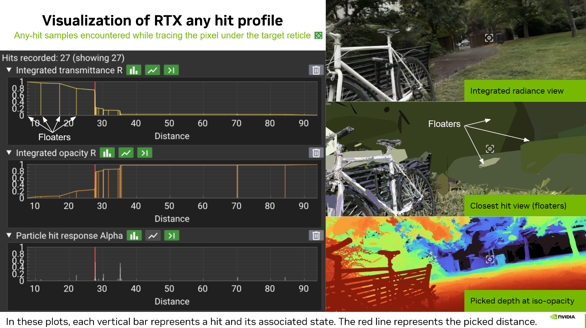

In practice, we set the `Depth Iso Threshold` parameter to a default integrated transmittance value of 0.7 (corresponding to an integrated opacity of 0.3), which leads to coherent results with most scenes. If the threshold is not reached, the pixel contribution is discarded. Note that this is only performed when a depth is required (lighting enabled, DLSS enabled, auto-focus, etc.). When none of these modes are activated, all pixels are preserved.

What does this imply? When activating lighting in the UI (renderer panel or menu bar), objects may appear slightly thinner than when lighting is disabled. The threshold must be set carefully according to the model. It is currently a global threshold per rendering method (rasterization, ray tracing), but may be moved to a per-splat-set threshold in the future, since some models are noisier or fuzzier than others — this strongly depends on the quality of the reconstruction. 

Note that this method also helps, in some cases, as seen in the previous figure, to mitigate the floater issue. When a floater catches the lighting in front of the expected surface, it is possible to lower the threshold slightly, which will tend to push the iso-surface back to the next layer of Gaussians. Here again, this is an approximation but an artist-friendly parameter.

### 1.2. Distance Picking in Stochastic Splat (Raster) and Stochastic Any Hit (Ray Tracing) Modes

In this mode, the choice is straightforward: the distance to the particle selected by stochastic transparency is used directly. Since the MSAA variant is not implemented, there is only one sample per frame, and each sample selects a single particle. The retained distance is the distance to that unique selected particle (see section [1.4](#14-hit-distance-for-a-single-3d-gaussian-particle)). Lighting is then computed per sample, and the resulting color for the pixel is accumulated through an average over the total accumulation frames. The surface is thus not stable over time, and the computed lighting is more of a volumetric lighting than a surface-based lighting.

### 1.3. Distance Picking in Stochastic Pass (Ray Tracing) Mode

With the Stochastic Pass mode, the approach falls between the two previous modes. Some passes are discarded, and only the results of the selected pass are kept. Within the selected pass, the iso-opacity surface depth picking approach is used. If no depth is found for the pass — i.e. the threshold is not reached — the distance to the farthest particle hit of the pass is used as a fallback. In this way, each selected sample (a pass in this case) can be lit as for Stochastic Splat. Discarding an entire pass because the iso-opacity threshold is not reached would lead to a biased stochastic transparency result.

### 1.4. Hit distance for a Single 3D Gaussian Particle

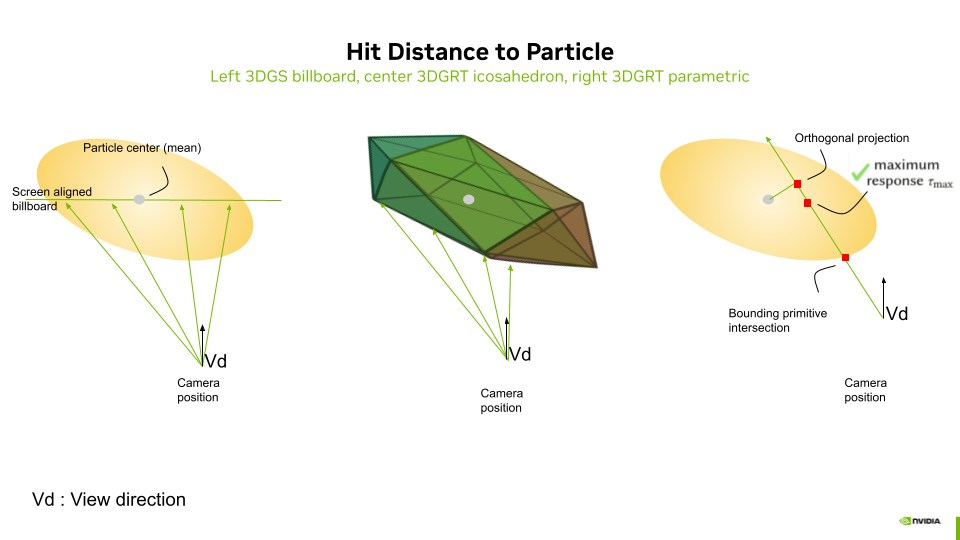

#### 1.4.1. Ray tracing mode

In ray tracing mode, the distance, retrieved by the [any-hit shader](../shaders/threedgrt_raytrace.rahit.slang) in `payload.dist[i]` and used for depth picking, depends on the acceleration structure geometry mode and on the intersection computation method. It is the same distance used for sorting:

**Icosahedron mesh mode.** Each particle is represented by an icosahedron (20 triangles). The hardware ray–triangle intersection provides `RayTCurrent()` as the distance to the **front face of the icosahedron** proxy. This is an actual geometric surface intersection. The icosahedron surface approximates the ellipsoid boundary at a radius scaled by the golden ratio in canonical space, producing a distance that sits on the "shell" of the particle.

**AABB parametric mode.** Each particle is represented by an axis-aligned bounding box. A custom intersection shader ([threedgrt_raytrace.rint.slang](../shaders/threedgrt_raytrace.rint.slang)) computes `hitT` via `particleDensityHitInstance()` as the distance to the **point of maximum density** along the ray — the closest point on the ray to the Gaussian center in canonical space:

$$t_{\text{hit}} = \frac{-\mathbf{o}_c \cdot \mathbf{d}_c}{\mathbf{d}_c \cdot \mathbf{d}_c}$$

where $\mathbf{o}_c$ and $\mathbf{d}_c$ are the ray origin and direction in canonical (unit-sphere) space.

#### 1.4.2. Rasterization mode

In rasterization mode, the distance used for a single particle hit is the distance to the screen-aligned billboard that passes through the particle center. It is simply the value of the depth for the given fragment, transformed back to world coordinates. The result can thus be used to compute lighting in world coordinates and is compatible with the ray tracing pipeline in hybrid mode.

#### 1.4.3. Comparison of Picked Surface Results Depending on Hit Distance Method

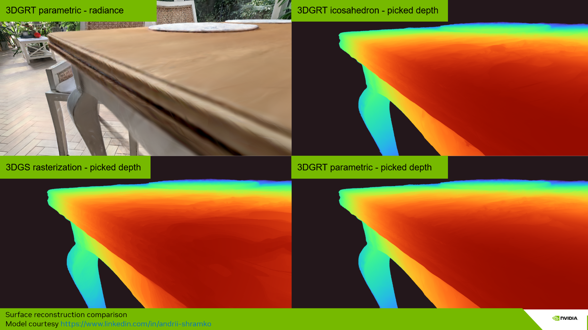

### 1.5. Front-to-Back Rasterization

The iso-opacity surface approach requires the integrated transmittance/opacity to pick a surface depth. Since transmittance is updated front-to-back starting from a value of 1.0 (as in ray tracing mode), we adapt the rasterization — originally back-to-front — to a front-to-back mode. This mode is only activated when a picked surface is needed (lighting, DLSS, auto-focus, etc.). In all other cases, the default back-to-front rasterization is used, as it is faster. When front-to-back is activated, the global sorting order is simply inverted.

The front-to-back pass then uses interlocked (atomic) operations and an intermediate image buffer to store the running transmittance and the picked depth at the fragment stage (see [threedgs_raster.frag.slang](../shaders/threedgs_raster.frag.slang) and [threedgut_raster.frag.slang](../shaders/threedgut_raster.frag.slang)). An option to disable the interlocked mode is available for faster evaluation at the cost of minor artifacts (Renderer Properties > Rasterization Specifics > FTB). The front-to-back fragment shader excerpt is presented below:

``` c
...

#if FRONT_TO_BACK && NEED_SURFACE_INFO
// For FTB: depth buffer accessed as storage image (R=depth, G=transmittance)
// globallycoherent ensures memory coherency between interlock-protected fragment invocations
[[vk::binding(BINDING_RASTER_DEPTH, 0)]] globallycoherent RWTexture2D<float2> depthTransmittanceBuffer;
#endif

...

#if FRONT_TO_BACK
  // FTB: Output depth for depth picking (first significant splat) using storage image
  // fragCoord.z is the normalized device depth [0,1]
  int2 pixelCoord = int2(fragCoord.xy);

#if FTB_SYNC_MODE == FTB_SYNC_INTERLOCK
  beginInvocationInterlock();
#endif
  const float2 current           = depthTransmittanceBuffer[pixelCoord];
  const float  prevTransmittance = current.g;
  const float  transmittance     = prevTransmittance * (1.0 - opacity);
  float  depth                   = current.r;
  if(depth == 0 && transmittance < frameInfo.depthIsoThreshold)
  {
    depth = fragCoord.z;
  }
  // Write back: depth in R, transmittance in G
  depthTransmittanceBuffer[pixelCoord] = float2(depth, transmittance);
#if FTB_SYNC_MODE == FTB_SYNC_INTERLOCK
  endInvocationInterlock();
#endif
#endif // FRONT_TO_BACK
```

#### 1.5.1. Vulkan Blend Modes for Back-to-Front (BTF) Rasterization — Baseline

By default, rasterization uses **back-to-front (BTF)** ordering with the standard "over" compositing operator. The fragment shader outputs `float4(color.rgb, opacity)` and the Vulkan blend state is configured as:

| Component | Source Factor | Destination Factor | Operation |
|-----------|--------------|-------------------|-----------|
| Color | `SRC_ALPHA` | `ONE_MINUS_SRC_ALPHA` | Add |
| Alpha | `ONE` | `ONE` | Add |

This gives: $C_{\text{dst}} = C_{\text{src}} \cdot \alpha_{\text{src}} + C_{\text{dst}} \cdot (1 - \alpha_{\text{src}})$, with alpha accumulated additively.

The alpha channel uses additive blending (`ONE / ONE`) rather than the same factors as the color channel. The destination alpha additively accumulates the total opacity of all splats rendered so far. This accumulated opacity is later used by the mesh color pass (Pass 3) to compute the remaining transmittance $(1 - \alpha_{\text{dst}})$, which determines how much of the mesh color is visible behind the splats. In pure BTF mode without meshes, the alpha channel is unused for display.

#### 1.5.2. Adaptation of Vulkan Blend Modes for Front-to-Back (FTB) Rasterization

When **front-to-back (FTB)** mode is activated, the blend state switches to the "under" compositing operator with premultiplied alpha. The fragment shader outputs `float4(color.rgb * opacity, opacity)` and the blend configuration becomes:

| Component | Source Factor | Destination Factor | Operation |
|-----------|--------------|-------------------|-----------|
| Color | `ONE_MINUS_DST_ALPHA` | `ONE` | Add |
| Alpha | `ONE_MINUS_DST_ALPHA` | `ONE` | Add |

This gives: $C_{\text{dst}} = C_{\text{src}}^{\text{premul}} \cdot (1 - \alpha_{\text{dst}}) + C_{\text{dst}}$, where the destination alpha accumulates the total opacity seen so far, and incoming contributions are attenuated by the remaining transmittance $(1 - \alpha_{\text{dst}})$.

The normal buffer uses the same blend operators as the color buffer in both modes. The depth buffer, however, is handled differently: in FTB mode it is accessed as a **storage image** with manual interlocked reads/writes (not as a color attachment), while in BTF mode it is a standard color attachment with hardware blending.

The blend states are configured in the `initPipelines()` method of [gaussian_splatting.cpp](../src/gaussian_splatting.cpp).

#### 1.5.3. Three-Pass FTB Rendering for Mesh–Splat Compositing

When a scene contains both meshes and Gaussian splats, front-to-back rasterization requires a three-pass approach to correctly composite them. The issue is that in FTB mode, splats are rendered front-to-back and accumulated into the framebuffer — but meshes are opaque and must interact correctly with the splat transmittance. A single pass cannot handle this because the mesh contribution depends on the total accumulated splat transmittance at each pixel, which is not yet known when the mesh would be drawn.

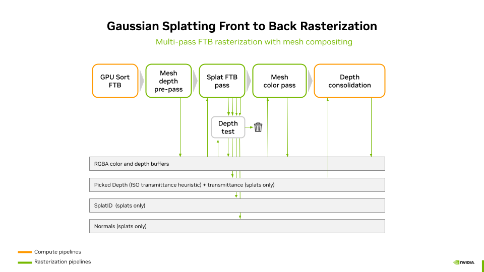

The three passes are:

1. **Mesh depth pre-pass** — Meshes are rendered with depth writes enabled but color writes disabled (output black). This writes the mesh depth into the hardware depth buffer so that splats behind meshes are correctly rejected by the depth test.
2. **Splat FTB pass** — Splats are rendered front-to-back with the "under" blend operator. The depth test against the mesh depth buffer ensures that only splats in front of meshes contribute. Color and transmittance are accumulated into the framebuffer, and depth picking is performed via the storage image.
3. **Mesh color pass** — Meshes are rendered again, this time with color output. The blend state uses the accumulated splat alpha (stored in the destination alpha channel) as transmittance: $C_{\text{final}} = C_{\text{mesh}} \cdot (1 - \alpha_{\text{dst}}) + C_{\text{splats}}$. This correctly composites the mesh behind all the splats that were accumulated in pass 2.

After these three passes, a **depth consolidation pass** writes the picked splat depth (from the storage image) into the hardware depth buffer. A screen triangle is used to perform this operation (see [depth_consolidate.frag.slang](../shaders/depth_consolidate.frag.slang)). This enables visual helpers and other post-effects to access the complete scene depth including both meshes and splats. Note that in hybrid mode, the [ray generation shader](../shaders/threedgrt_raytrace.rgen.slang) reads the picked depth directly from the raster depth storage image via `initRtxStateFromRasterPass()` — it does not depend on the consolidation pass. The consolidation pass still runs in hybrid mode but serves the same purpose as in pure rasterization: providing a complete hardware depth buffer for visual helpers and other post-effects.

## 2. Normal Vector Integration and Picking

Depending on the rendering strategy used to integrate radiance — stochastic transparency or sorted blending — **normal vectors** are either picked from the selected sample in the first case, or integrated over all the splats intersected by the ray (ray tracing) or covered by the pixel (rasterization) in the second. Subsections 2.1–2.3 describe how the normal is obtained under each strategy; the computation of the normal for a single particle (one ray/pixel and one particle) is described in section 2.4.

### 2.1. Normal Integration in Sorted Blending Mode

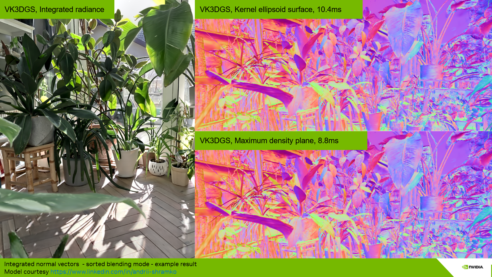

With the **Sorted Blending** strategy, the normal is accumulated in the same way as radiance, using the normal at the particle–ray intersection weighted by the particle's alpha response at the hit point. In rasterization, this is performed through alpha blending of the normal values, just as for colors. In ray tracing, the normal is integrated for each hit following the same alpha-blending equation as for radiance:

$$\mathbf{N} = \sum_{i} \mathbf{n}_i \cdot \alpha_i \cdot T_i, \quad \text{where} \quad T_i = \prod_{j < i}(1 - \alpha_j)$$

where $\mathbf{N}$ is the integrated normal, $\mathbf{n}_i$ is the world-space normal of particle $i$ at the hit point, $\alpha_i$ is its alpha response at the hit point, and $T_i$ is the transmittance.

In both cases, a final pass checks the norm of the integrated normal vector to detect degenerate results — for example, integrating two opposite vectors with equal weight and magnitude would produce a null vector. In case of a degenerate normal, the vector pointing toward the camera is used as a fallback.

### 2.2. Normal Picking in Stochastic Splat (Raster) and Stochastic Any Hit (Ray Tracing) Mode

With the **Stochastic Splat** strategy in rasterization mode, only one sample is picked at a time. This sample has an opaque color, and the normal computed at the pixel for the selected particle is used directly.

### 2.3. Normal Integration in Stochastic Pass (Ray Tracing) Mode

With the **Stochastic Pass** strategy, the approach is a mix between full integration and Monte Carlo picking: normals are integrated along with colors within each pass, and the resulting normal vector for the pass is used as the final normal. It is thus representative of the integrated radiance for that pass.

In any stochastic approach, the normal is never temporally accumulated. Instead, the picked normal is used to compute the shading of the selected sample, whose final color is then temporally accumulated. **Sorted Blending**, **Stochastic Splat and Any Hit**, and **Stochastic Pass** lead to variations in the final lit images:
- **Sorted Blending** produces more of a surface-like hard shading and shadowing, 
- **Stochastic Splat and Any Hit** yields more of a volumetric soft shading and shadowing. 
- **Stochastic Pass** sits in between and tends toward one or the other depending on the number of hits per pass.

### 2.4. Normal Vectors of a Single 3D Gaussian Particle

We present two methods to compute particle normals (see the "Normal vectors" option in the renderer control panel):
- **Max density plane** (default method)
- **Kernel ellipsoid**

In both cases, we approximate the normal at the ray–particle intersection. We never use the maximum density response point for the computation of normals, since this leads to a non-continuous surface. Instead, we either compute the normal at the surface of the ellipsoid described by the minimal kernel response (**Kernel ellipsoid** mode) or use the normal of the plane that linearly approximates the maximum density surface (**Max density plane** mode).

The **Kernel ellipsoid** method is not developed in detail here, since it is slower to compute and does not lead to better visual quality when shading. This method is implemented in the function `computeEllipsoidNormal` and kept for reference in [threedgrt_h.slang](../shaders/threedgrt_h.slang).

The **Max density plane** method computes the plane that linearly approximates the maximum density surface [Kheradmand2025], then uses its normal $\mathbf{n}$. Let $\boldsymbol{\mu}$ be the mean of the Gaussian particle and $\mathbf{o}$ be the origin of the ray associated with a pixel. For any point $\mathbf{x}$ on the plane, the plane is defined by:

$$\mathbf{n}^\top (\mathbf{x} - \boldsymbol{\mu}) = 0, \quad \text{where} \quad \mathbf{n} = \Sigma^{-1}(\boldsymbol{\mu} - \mathbf{o})$$

The **Max density plane** method is implemented in the function `computeEllipsoidNormalMaxDensityPlane` defined in [threedgrt_h.slang](../shaders/threedgrt_h.slang).

## 3. Lighting and Shading in the Rasterization Pipelines

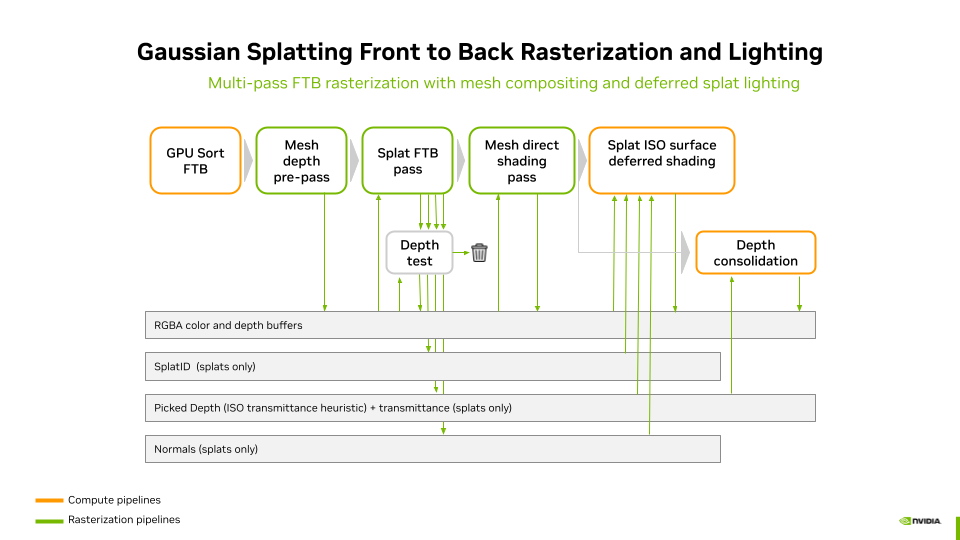

In the rasterization pipelines, lighting does not include indirect illumination or shadows. Shading and lighting are performed in a **deferred shading** pass. The stages of the rasterization lighting pipeline are:

1. **GPU Sort FTB** — Splats are sorted front-to-back on the GPU. This inverts the default back-to-front order to enable transmittance-based depth picking.

2. **Mesh depth pre-pass** — Meshes are rendered with depth writes enabled but color writes disabled. This populates the hardware depth buffer with mesh geometry so that splats behind meshes are correctly rejected by the depth test in the next pass.

3. **Splat FTB pass** — Splats are rasterized front-to-back using the "under" blend operator with premultiplied alpha. Fragments behind meshes are discarded by the depth test. This pass writes to four buffers:
    - **RGBA color buffer** — accumulated splat radiance via FTB blending
    - **Normal buffer** — integrated splat normals (weighted by alpha × transmittance)
    - **Picked depth + transmittance** — storage image with interlocked R/W; the picked depth is set when the transmittance crosses the iso-opacity threshold
    - **Splat ID buffer** — the global splat ID of the particle at the picked depth

4. **Mesh direct shading pass** — Meshes are rendered again, this time with color output. Each mesh is lit with its own material during rasterization (forward shading). The blend state uses the accumulated splat alpha in the destination as transmittance: the mesh color is multiplied by $(1 - \alpha_{\text{dst}})$ and added to the accumulated splat color, correctly compositing the mesh behind all previously accumulated splats.

5. **Depth consolidation** — A fullscreen triangle pass reads the picked splat depth from the storage image and writes it into the hardware depth buffer via `SV_Depth`. Pixels with no valid picked depth are discarded, preserving the existing mesh depth. This provides a complete scene depth buffer for visual helpers and post-effects.

6. **Splat ISO surface deferred shading** — A compute shader ([deferred_shading.comp.slang](../shaders/deferred_shading.comp.slang)) reads the color, normal, picked depth, and splat ID buffers. For each splat pixel, it reconstructs the world position from the picked depth, looks up the splat set material via the splat ID, and applies lighting from all scene lights (or a camera headlight if no lights are defined). Mesh pixels (no valid splat ID) are passed through unchanged. No shadows are computed in this path.

## 4. Lighting, Shadows and Shading in the Ray Tracing Pipeline

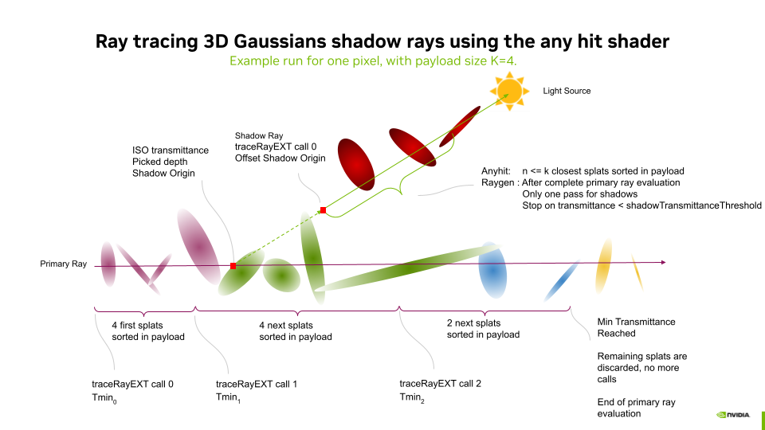

Shadow rays are traced after the ray evaluation of the bounce that performs color, normal vector integration and iso-surface picking. For each light, a single pass of any-hit is used (one call to `traceRayEXT`). A `particle shadow offset` is applied along the light direction to avoid self-shadowing artifacts, and tracing is terminated early when the accumulated shadow transmittance drops below `Particle shadow threshold`. 

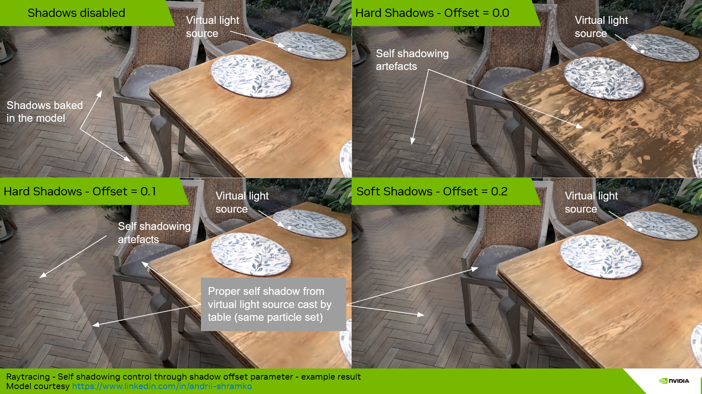

Using the any-hit shader with multiple sorted hits — rather than accepting only the first encountered hit — permits capturing accurate silhouettes of objects made of splats. A single unsorted hit would lead to strongly dilated silhouettes and would capture floaters, leading to inaccurate shadows.

The `Particle shadow threshold` (`shadowTransmittanceThreshold`) controls how many hits are integrated before early termination. A high threshold (e.g. 0.99) terminates early and produces hard, opaque shadows. A lower threshold allows more particles to contribute, producing softer shadow edges at the cost of potentially unwanted semi-transparent inaccurate shadows when the payload cannot capture all occluding particles.

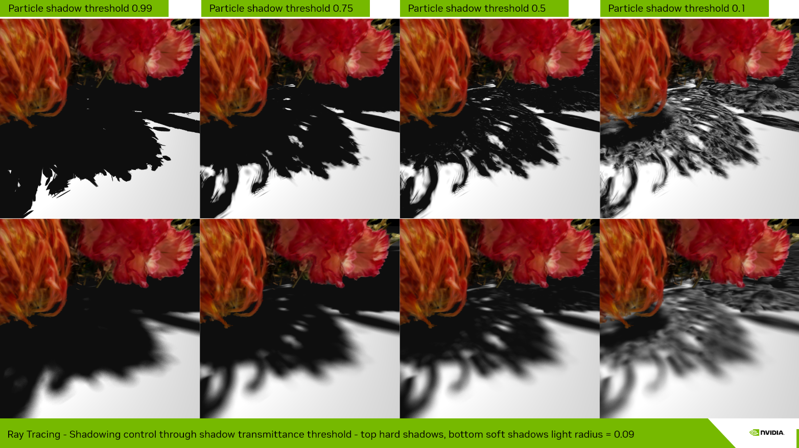

Integrating multiple samples (up to the payload size) on shadow rays also enables colored transmittance at shadow edges. This stained-glass tint effect is controlled by the `Colored shadow strength` parameter, combined with a `Particle shadow threshold` lower than 0.99.

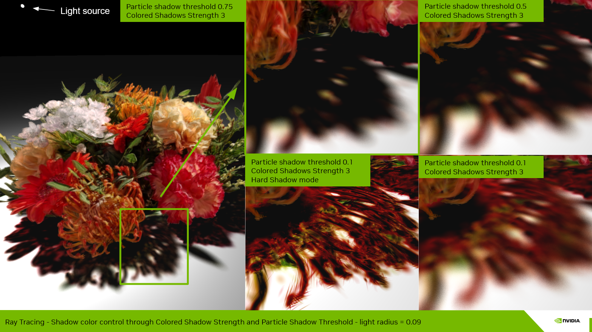

## 5. Lighting, Shadows and Shading in the Hybrid Pipelines

In hybrid mode, the rasterization deferred shading pass is disabled. Instead, the ray tracing pipeline ingests the pixel's integrated radiance, normal, and picked depth from the raster pass output buffers, and uses those values in place of first-bounce ray tracing. The rest of the pipeline is identical to pure ray tracing. At the end of each bounce, shading — including lighting and shadows — is computed for both the mesh and splat set results, then composited and integrated into the final pixel color.

## References

Please consult the consolidated [References](../README.md#references) section of the main `README.md`.

