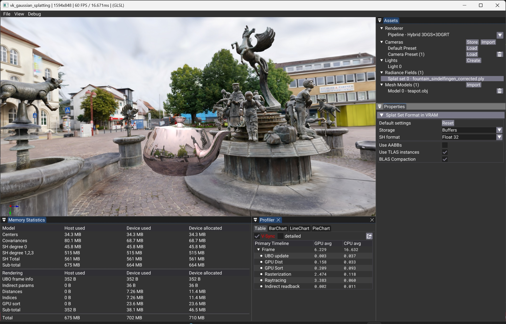

# Vulkan Gaussian Splatting Overview

## Table of Contents

1. [Workflow](#workflow)
2. [Assets and Properties Panels](#assets-and-properties-panels)
3. [Renderer Pipelines and Properties](#renderer-pipelines-and-properties)
4. [Radiance Fields / Splat Set](#radiance-fields--splat-set)
    - [Splat Set Format in VRAM](#splat-set-format-in-vram)
    - [RTX Acceleration Structure](#rtx-acceleration-structure)
5. [Mesh Models](#mesh-models)
6. [Cameras](#cameras)
7. [Lights](#lights)
8. [Monitoring Panels](#monitoring-panels)
9. [Continue Reading](#continue-reading)
10. [References](#references)

## Workflow

The visualization workflow follows these main steps:

1. Loading the 3DGS Model into RAM.
2. Data Transformation & Upload to VRAM
    - The splat attributes (positions, opacity, Spherical Harmonic (SH) coefficients from degree 0 to 3, and rotation scale) are transformed if necessary and uploaded into VRAM. 
    - Additional acceleration structures are generated in VRAM for Ray tracing or Hybrid rendering, see details in the ray tracing page.
    - The data storage, format and acceleration structure related parameters can be updated during the visualization, the data in VRAM and the pipelines are then regenerated on the flight.
    - Changing those parameters may have strong impact on rendering performances, this topic is devised in the rendering pipeline pages.
3. Rendering
    - The rendering pipeline/method can be changed dynamically during the visualization and allows to easily compare the performance of the different approaches.
    - Several monitors can be visualized at any moment to compare the performances and resource consumption of the different approaches.

## Assets and Properties Panels

The **Assets** panel regroups access to the **Renderer** and to the differents scene elements; **Cameras**, **Lights**, **Radiance Fields** and **Meshes**.

Selecting an Asset in the Assets Panel will generaly open its related properties in the Properties panel located below.

## Renderer Pipelines and Properties

When starting the application the Renderer is selected in the **Asset panel** and the properties of the selected pipeline appear below in the **Properties panel**. The **down arrow** at the right of the pipeline name in the **Assets > Renderer** section allows to switch the active rendering pipeline. 

The description of the respective properties and the implementation details of the different pipelines is devised in the following sections.

| Pipeline name                | Implementation details |
|--|--|
| **Raster vertex shader 3DGS**  | [VK3DGSR: 3D Gaussian Splatting (3DGS) [Kerbl2023] using Vulkan Rasterization](./rasterization_of_3d_gaussian_splatting.md) |
| **Raster mesh shader 3DGS**| [VK3DGSR: 3D Gaussian Splatting (3DGS) [Kerbl2023] using Vulkan Rasterization](./rasterization_of_3d_gaussian_splatting.md) |
| **Raster mesh shader 3DGUT**| [VK3DGUT: 3D Gaussian Unscented Transform (3DGUT) [Wu2024] Using Vulkan Rasterization](./rasterization_of_3dgut.md) |
| **Ray tracing 3DGRT**        | [VK3DGRT: 3D Gaussian Ray Tracing (3DGRT) [Moënne-Loccoz2024] using Vulkan RTX](./ray_tracing_3d_gaussians.md)    |
| **Hybrid 3DGS+3DGRT**        | [VK3DGHR: 3D Gaussian Hybrid Rendering Using Vulkan RTX and Rasterization](./hybrid_rendering_3d_gaussians.md)                   |
| **Hybrid 3DGS+3DGUT**        | [VK3DGHR: 3D Gaussian Hybrid Rendering Using Vulkan RTX and Rasterization](./hybrid_rendering_3d_gaussians.md)                   |

## Radiance Fields / Splat Set

Once a ply file is opened a **Splat set** entry will show up in the **Assets** panel under the **Radiance Fields** entry. Currently only one **Splat set** can be opened at a time. When the **Splat set** entry is selected its available properties shows up in the **Properties panel** below the **Assets** panel.

### Splat Set Format in VRAM

The **Splat Set Format in VRAM** group allows users to configure how the model's data is stored in VRAM.
*	**Storage** – Selects between **Data Buffers** and **Textures** for storing model attributes, including:
    *	Position
    *	Color deduced from SH degree 0 at construction and Opacity 
    *	Covariance Matrix
    *	Spherical Harmonics (SH) Coefficients (for degrees higher than 0)

This **storage** option impacts memory access patterns and performance, allowing comparisons between different storage strategies. In both modes, splat attributes are stored linearly in memory in the order they are loaded from disk.
*	**Data Buffer Mode** – Uses a separate buffer for each attribute type.
    *	This layout improves memory lookups during shader execution, as threads access attributes in sequential stages (e.g., first positions, then colors, etc.).
    *  	Buffers are allocated and initialized by the `initDataBuffers` method (see [splat_set_vk.cpp](../src/splat_set_vk.cpp)).
*	**Texture Mode** – Uses a separate texture map for each attribute type.
    *	All textures are 4092 pixels wide, with the height determined as a power of two based on the attribute's memory footprint.
    *	Linear storage in textures is suboptimal due to square-based cache for texel fetches, but data locality cannot be easily optimized as sorting is view-dependent.
    *	Future work could explore organizing data as in [Morgenstern2024] to leverage texture compression.
    *   Textures are allocated and initialized by the `initDataTextures` method (see [splat_set_vk.cpp](../src/splat_set_vk.cpp)).

Finally, the **SH format** selector controls the precision used for storing spherical harmonics (SH) coefficients.

- **SH format** – Selects between **Float32**, **Float16**, and **UInt8** for SH coefficient storage, balancing precision and memory usage.
    *  By lowering the size of the SH data to 8 bits (**UInt8**), one can achieve very high performance gains when using the **rasterization** and **hybrid** pipelines, with perceptually invisible quality loss. The pipeline, which is already running at very high performance when using **Float32**, is bounded by the data fetch from memory. Hence, reducing the size of the coefficients, which make up a large part of the payload, massively reduces the data throughput and reduces the frame rendering time.

### RTX Acceleration Structure

The **RTX Acceleration Structure** group allows to configure the associated  Acceleration Structure used by the ray tracing rendering pipeline. 

Those options have strong impact on performance and memory consumption. They are documented and devised more in detail in the [VK3DGRT: 3D Gaussian Ray Tracing (3DGRT) [Moënne-Loccoz2024] using Vulkan RTX](./doc/ray_tracing_3d_gaussians.md) page.

## Mesh Models

The **Mesh Models** entry in the asset manager allows importing 3D meshes from .obj files along with their material definitions defined in accompanying .mtl files. Note that texture maps are not yet supported. To import a mesh, use the **Import** button and select an .obj file.

Some interesting .obj files are automatically downloaded by the CMake and can be found in the **_downloaded_resources** folder of the repository.

Once imported, a mesh can be selected in the asset tree which shows its transform and materials properties in the **Properties** panel. 

The Material Properties panel allows selecting three shading **Models**: 

1. **No indirect**: Computes the shading without talking into account indirect contributions. The mesh will not present any reflection or refraction. This mode works for all the rendering pipelines.
2. **Reflective**: Activates the tracing of secondary rays to compute reflections of the environment (splat set and other meshes) onto the mesh. The proportion of reflection is controlled by the **specular** field.
3. **Refractive**: Activates the tracing of secondary rays to compute refractions, showing the environment (splat set and other meshes) throught the mesh. Using this mode, one shall set **transmittance** to a value greater than 0.0 to render transparency. The **IOR** field is used to change the index of refraction (use 1.5 for glass material).

**Reflective** and **Refractive** modes have no effect when using rasterization pipelines. 

## Cameras

The **Camera** asset allows you to visualize and set the current camera settings and interaction modes. While navigating to an interesting location, it is also possible to **store** the current camera setting as a preset. Later on, this preset can be reloaded using its associated **load** button.

It is also possible to **import** camera presets (cameras.json files) as defined in the [INRIA model bundle](../readme.md#Datasets). This is very useful for running benchmarks.

Pressing the `space bar` will **load** the next camera preset, making it convenient to quickly activate the presets one after the other.

## Lights

When adding meshes to the scene, they are lit by a default light source whose parameters can be set in the **Lights** tree. It is possible to create additional light sources by pressing the **Create** button.

Note: Light sources only affect the 3D meshes and not the splat set.

## Monitoring Panels  

The **Memory Statistics Panel** reports RAM (host) and VRAM (device) usage for both **model storage** (3DGS data) and **rendering** (buffers used for rasterization). The **G-Buffer size** is not reported. For device memory, both **allocated** and **used** amounts are displayed.  

The **Profiling Panel** reports the **GPU** and **CPU** time spent on different stages of the rendering process. The set of timers varies depending on the selected sorting method.  

The **Statistics Panel** provides additional information, such as:  
- The **total number of splats** in the model.  
- The **number of splats** selected for rasterization after sorting.  
- The number of **Mesh shader work groups** if Mesh Shader pipeline and GPU sort are both activated.

> **Note**: To properly assess the performance of the pipelines, one should **deactivate vertical synchronization** (V-Sync) either from the **view > v-sync** menu, the **Renderer properties panel**, or the **Profiler window**. Otherwise, the system does not run at optimal performance, and the reported timings in the Window top bar and Profiler Window are generally higher (and fps lower) than what is possible to achieve. The V-Sync option is enabled by default for the sake of energy saving.

## Continue Reading

1. [VK3DGSR: 3D Gaussian Splatting (3DGS) [Kerbl2023] using Vulkan Rasterization](./rasterization_of_3d_gaussian_splatting.md)
2. [VK3DGRT: 3D Gaussian Ray Tracing (3DGRT) [Moënne-Loccoz2024] using Vulkan RTX](./ray_tracing_3d_gaussians.md)
3. [VK3DGHR: 3D Gaussians Hybrid Rendering Using Vulkan RTX and Rasterization](./hybrid_rendering_3d_gaussians.md)

## References

Please consult the consolidated [References](../readme.md#References) section of the main `readme.md`.
