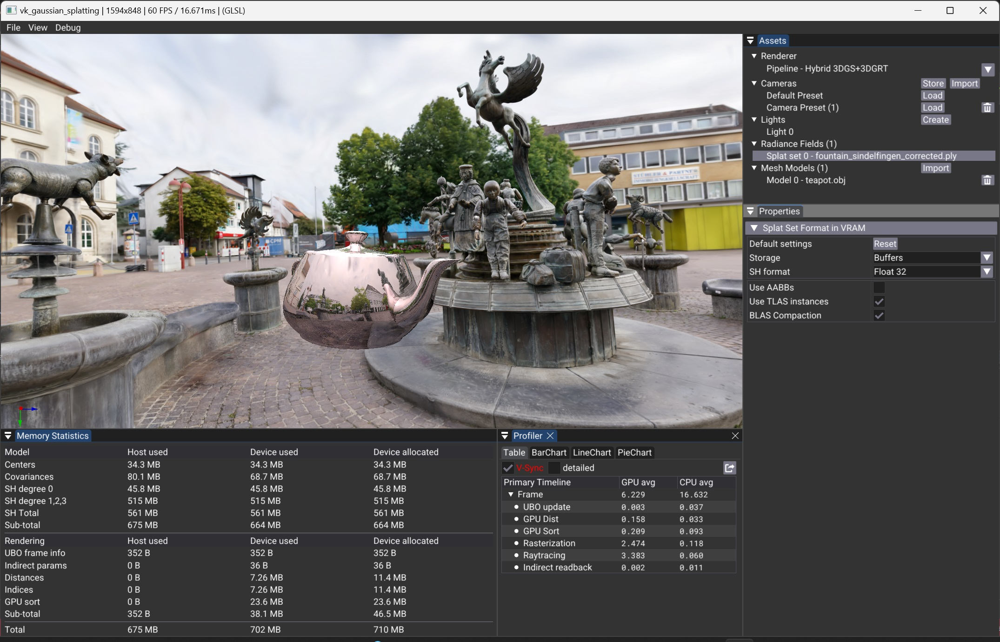

# Vulkan Gaussian Splatting Overview

## Table of Contents

1. [Workflow](#1-workflow)
2. [File Menu and Project Management](#2-file-menu-and-project-management)
3. [Assets and Properties Panels](#3-assets-and-properties-panels)
4. [Renderer Pipelines and Properties](#4-renderer-pipelines-and-properties)
    - [Global Settings](#41-global-settings)
    - [Pipeline-Specific Properties](#42-pipeline-specific-properties)
5. [Radiance Fields / Splat Set](#5-radiance-fields--splat-set)
    - [Shared Properties](#51-shared-properties-radiance-fields-selected)
    - [Per-Instance Properties](#52-per-instance-properties-splat-set-selected)
6. [Mesh Models](#6-mesh-models)
7. [Cameras](#7-cameras)
8. [Lights](#8-lights)
9. [Toolbar](#9-toolbar)
10. [Image Comparison](#10-image-comparison)
11. [Shader Feedback](#11-shader-feedback)
12. [Monitoring Panels](#12-monitoring-panels)
13. [Continue Reading](#13-continue-reading)
14. [References](#14-references)

## 1. Workflow

The visualization workflow follows these main steps:

1. Loading the 3DGS Model into RAM.
2. Data Transformation & Upload to VRAM
    - The splat attributes (positions, opacity, Spherical Harmonic (SH) coefficients from degree 0 to 3, and rotation scale) are transformed if necessary and uploaded into VRAM. 
    - Additional acceleration structures are generated in VRAM for Ray tracing or Hybrid rendering, see details in the ray tracing page.
    - The data storage, format and acceleration structure related parameters can be updated during the visualization, the data in VRAM and the pipelines are then regenerated on the flight.
    - Changing those parameters may have strong impact on rendering performances, this topic is devised in the rendering pipeline pages.
3. Rendering
    - The rendering pipeline/method can be changed dynamically during the visualization and allows to easily compare the performance of the different approaches.
    - Several monitors can be visualized at any moment to compare the performances and resource consumption of the different approaches.

## 2. File Menu and Project Management

The **File** menu provides the following operations:

*   **New project** – Resets the scene to a clean state.
*   **Open project** / **Recent projects** – Loads a previously saved project file (`.vkgs`), restoring all splat sets, meshes, camera presets, and renderer settings.
*   **Save project** – Saves the current scene configuration to a `.vkgs` project file. Splat sets and meshes are not embedded in the project file; only relative paths to these resources are stored, along with their transforms, materials, and renderer settings.
*   **Open Splat Set** / **Recent Splat Sets** – Imports a radiance field from a `.ply`, `.spz`, or `.splat` file.
*   **Open Mesh** – Imports a 3D mesh from an `.obj` file.
*   **Exit** – Closes the application (`Ctrl+Q`).

Files can also be loaded by **drag and drop** onto the viewport. Supported formats are `.ply`, `.spz`, and `.splat` (splat sets), `.obj` (meshes), and `.vkgs` (project files). Multiple files can be dropped at once.

## 3. Assets and Properties Panels

The **Assets** panel regroups access to the **Renderer** and to the different scene elements; **Cameras**, **Lights**, **Radiance Fields** and **Meshes**.

Selecting an Asset in the Assets Panel will generally open its related properties in the Properties panel located below.

## 4. Renderer Pipelines and Properties

When starting the application the Renderer is selected in the **Asset panel** and the properties of the selected pipeline appear below in the **Properties panel**. The **down arrow** at the right of the pipeline name in the **Assets > Renderer** section allows to switch the active rendering pipeline. 

The **Renderer** properties panel is organized in several groups. The first groups contain settings common to all pipelines, followed by pipeline-specific tabs documented in the pages linked in the table below.

*   **Pipeline** – Selects the active rendering pipeline (see table below).

### 4.1. Global Settings

These settings apply to all rendering pipelines:

*   **V-Sync** – Toggles vertical synchronization on or off.
*   **Default settings** – Resets all renderer settings to their defaults.

*   **Color Format** – Selects the color buffer format, trading precision for memory. Available formats are **R8G8B8A8 UNORM** (32-bit, lowest memory), **R16G16B16A16 SFLOAT** (64-bit, default), and **R32G32B32A32 SFLOAT** (128-bit, highest precision). Higher precision improves temporal accumulation quality.

* **Visualize** selector is available when a ray tracing pipeline is active (pure RTX or hybrid). It switches the viewport output between the final render and various debug views:
    *   **Final render** – Standard composited output.
    *   **Clock cycles** – GPU clock cycle heatmap with adjustable min/max range and shift.
    *   **Ray Hit Count** – Number of ray-particle intersections per pixel with adjustable min/max range and shift.
    *   **Depth (iso thres)** / **Depth (Closest hit)** / **Depth (for DLSS)** – Depth buffer visualizations with adjustable min/max range and shift.
    *   **Normal (Integrated)** / **Normal (closest hit)** / **Normal (For DLSS)** – Normal vector visualizations.
    *   **Splat ID (Harlequin)** – Per-splat identification with randomized colors.
    *   **DLSS** guide views (Input, Albedo, Specular, Normal, Motion, Depth) – Available only when DLSS is enabled, these display the G-buffer channels fed to DLSS.

*   **Wireframe** – Shows particle bounds in wireframe.
*   **Alpha culling threshold** – Discards splats with opacity below the threshold to skip low-contribution particles.
*   **Maximum SH degree** – Sets the highest Spherical Harmonics degree (0–3) used for view-dependent color.
*   **Show SH deg > 0 only** – Removes the base color from SH degree 0, applying only higher-degree SH over neutral gray. Useful for visualizing their contribution.
*   **Disable opacity gaussian** – Makes the full range of each Gaussian visible by disabling the alpha falloff, useful for analyzing splat distribution.
*   **Normal vectors** – Selects the method for computing normal vectors: **Max density plane** (tangent plane approximation, fast) or **Kernel ellipsoid** (ray-ellipsoid intersection, more accurate).
*   **Thin particle threshold** – Scale below which a particle axis is considered degenerate; such particles are treated as flat disks for normal computation.
*   **Lighting mode** / **Shadows mode** – Controls lighting and shadow evaluation on the splat set. These features are described in detail in the [Lighting and Shadows](./lighting_and_shadows.md) page.
*   **Temporal sampling** – Controls temporal accumulation of frames (**Automatic**, **Force enabled**, **Force disabled**). When enabled, results are accumulated over a configurable number of frames, improving quality for effects like depth of field and stochastic ray tracing.

### 4.2. Pipeline-Specific Properties

Each pipeline exposes additional properties in dedicated tabs (Rasterization or Ray tracing). The description of the respective properties and the implementation details of the different pipelines is devised in the following sections.

| Pipeline name                | Implementation details |
|--|--|
| **Raster vertex shader 3DGS**  | [VK3DGSR: 3D Gaussian Splatting (3DGS) [Kerbl2023] using Vulkan Rasterization](./rasterization_of_3d_gaussian_splatting.md) |
| **Raster mesh shader 3DGS**| [VK3DGSR: 3D Gaussian Splatting (3DGS) [Kerbl2023] using Vulkan Rasterization](./rasterization_of_3d_gaussian_splatting.md) |
| **Raster mesh shader 3DGUT**| [VK3DGUT: 3D Gaussian Unscented Transform (3DGUT) [Wu2024] Using Vulkan Rasterization](./rasterization_of_3dgut.md) |
| **Ray tracing 3DGRT**        | [VK3DGRT: 3D Gaussian Ray Tracing (3DGRT) [Moënne-Loccoz2024] using Vulkan RTX](./ray_tracing_3d_gaussians.md)    |
| **Hybrid 3DGS+3DGRT**        | [VK3DGHR: 3D Gaussian Hybrid Rendering Using Vulkan RTX and Rasterization](./hybrid_rendering_3d_gaussians.md)                   |
| **Hybrid 3DGUT+3DGRT**        | [VK3DGHR: 3D Gaussian Hybrid Rendering Using Vulkan RTX and Rasterization](./hybrid_rendering_3d_gaussians.md)                   |

## 5. Radiance Fields / Splat Set

Once a .ply file is opened, a **Splat set** entry appears in the **Assets** panel under the **Radiance Fields** tree. Multiple splat sets can be loaded simultaneously. Each splat set can also be duplicated to create additional instances that share the same underlying data but have independent transforms and materials.

The **Properties** panel shows different content depending on what is selected in the **Radiance Fields** tree:

- Selecting the **Radiance Fields** root node displays **shared properties** that apply to all splat sets (data format in VRAM and RTX acceleration structures).
- Selecting an individual **Splat set** entry displays **per-instance properties** (info, transform, material, and storage mode).

### 5.1. Shared Properties (Radiance Fields selected)

#### 5.1.1. Splat Set Format in VRAM

The **Splat Set Format in VRAM** group controls the data format used for all splat sets in VRAM.

- **SH format** – Selects between **Float32**, **Float16**, and **Uint8** for SH coefficient storage, balancing precision and memory usage.
    *  By lowering the size of the SH data to 8 bits (**Uint8**), one can achieve very high performance gains when using the **rasterization** and **hybrid** pipelines, with perceptually invisible quality loss. The pipeline, which is already running at very high performance when using **Float32**, is bounded by the data fetch from memory. Hence, reducing the size of the coefficients, which make up a large part of the payload, massively reduces the data throughput and reduces the frame rendering time.
- **RGBA format** – Selects between **Float 32**, **Float 16**, and **Uint8** for RGBA color and alpha storage, balancing precision and memory usage (16, 8, or 4 bytes per splat respectively).

#### 5.1.2. RTX Acceleration Structure

The **RTX Acceleration Structure** group configures the acceleration structure used by the ray tracing rendering pipeline. 

Those options have strong impact on performance and memory consumption. They are documented and devised more in detail in the [VK3DGRT: 3D Gaussian Ray Tracing (3DGRT) [Moënne-Loccoz2024] using Vulkan RTX](./ray_tracing_3d_gaussians.md) page.

### 5.2. Per-Instance Properties (Splat set selected)

Selecting an individual splat set instance in the tree shows the following property groups:

- **Splat Set Info** – Displays the total number of splats, SH degree, source file path, and how many instances share this splat set data.
- **Model Transform** – Per-instance translation, rotation, and scale. This allows placing multiple instances of the same splat set at different locations in the scene.
- **Material** – Per-instance material properties (ambient, diffuse, specular, emission, shininess) used when lighting is enabled. By default radiance fields are 100% emissive, meaning they appear as baked-in colors unaffected by lights. To see the impact of lighting, reduce the emission value and raise the diffuse value so that the splat set responds to the scene's light sources.
- **Splat Set Storage in VRAM** – Per-splat-set **Storage** mode, selecting between **Data Buffers** and **Textures** for storing model attributes including position, color and opacity, covariance matrix, and SH coefficients (for degrees higher than 0). Changes to this setting impact all instances sharing the same splat set.

This **Storage** option impacts memory access patterns and performance, allowing comparisons between different storage strategies. In both modes, splat attributes are stored linearly in memory in the order they are loaded from disk.
*	**Data Buffer Mode** – Uses a separate buffer for each attribute type.
    *	This layout improves memory lookups during shader execution, as threads access attributes in sequential stages (e.g., first positions, then colors, etc.).
    *  	Buffers are allocated and initialized by the `initDataBuffers` method (see [splat_set_vk.cpp](../src/splat_set_vk.cpp)).
*	**Texture Mode** – Uses a separate texture map for each attribute type.
    *	All textures are 4092 pixels wide, with the height determined as a power of two based on the attribute's memory footprint.
    *	Linear storage in textures is suboptimal due to square-based cache for texel fetches, but data locality cannot be easily optimized as sorting is view-dependent.
    *	Future work could explore organizing data as in [Morgenstern2024] to leverage texture compression.
    *   Textures are allocated and initialized by the `initDataTextures` method (see [splat_set_vk.cpp](../src/splat_set_vk.cpp)).

## 6. Mesh Models

The **Mesh Models** entry in the asset manager allows importing 3D meshes from .obj files along with their material definitions defined in accompanying .mtl files. Note that texture maps are not yet supported. To import a mesh, use the **Import** button and select an .obj file.

Some interesting .obj files are automatically downloaded by the CMake and can be found in the **_downloaded_resources** folder of the repository.

Once imported, a mesh can be selected in the asset tree which shows its transform and materials properties in the **Properties** panel. 

The Material Properties panel allows selecting three shading **Models**: 

1. **No indirect**: Computes the shading without taking into account indirect contributions. The mesh will not present any reflection or refraction. This mode works for all the rendering pipelines.
2. **Reflective**: Activates the tracing of secondary rays to compute reflections of the environment (splat set and other meshes) onto the mesh. The proportion of reflection is controlled by the **specular** field.
3. **Refractive**: Activates the tracing of secondary rays to compute refractions, showing the environment (splat set and other meshes) through the mesh. Using this mode, one shall set **transmittance** to a value greater than 0.0 to render transparency. The **IOR** field is used to change the index of refraction (use 1.5 for glass material).

**Reflective** and **Refractive** modes have no effect when using rasterization pipelines. 

## 7. Cameras

The **Camera** asset allows you to visualize and set the current camera settings and interaction modes. While navigating to an interesting location, it is also possible to **store** the current camera setting as a preset. Later on, this preset can be reloaded using its associated **load** button.

It is also possible to **import** camera presets (cameras.json files) as defined in the [INRIA model bundle](../readme.md#Datasets). This is very useful for running benchmarks.

Pressing the `space bar` will **load** the next camera preset, making it convenient to quickly activate the presets one after the other.

The camera properties also expose:

*   **Camera type** – Switches between **Pinhole** (standard perspective projection) and **Fisheye** (wide-angle lens simulation).
*   **Depth of Field** – Selects the DoF mode: **Disabled**, **Fixed focus** (manual focus distance), or **Auto focus** (focus at the point under the cursor). When enabled, an **Aperture** control adjusts the strength of the bokeh blur. Depth of field requires temporal sampling to converge.

Fisheye and Depth of Field are not available with the 3DGS pure rasterization pipelines.

## 8. Lights

By default lighting is disabled. When lighting is enabled (see [Global Settings](#41-global-settings)), both splat sets and meshes can be lit. If no light source has been created, a headlight attached to the camera is used. It is possible to create additional light sources by pressing the **Create** button in the **Lights** tree. Once at least one light source is created, the headlight is automatically disabled.

## 9. Toolbar

The **toolbar** is displayed at the top of the viewport, centered horizontally. It provides quick-access toggles and selectors for frequently used features, grouped as follows:

**Toggle buttons:**

*   **V-Sync** – Toggles vertical synchronization.
*   **Capture viewport** – Saves the current viewport to an image file (PNG, JPG, BMP, or HDR).
*   **Target overlay** – Locks the shader feedback cursor to a draggable crosshair on the viewport instead of following the mouse.
*   **Image comparison** – Activates the image comparison split-view mode (see [Image Comparison](#10-image-comparison)).
*   **Summary overlay** – Displays a floating overlay with key rendering statistics on top of the viewport.
*   **Edit mode** – Enables transform gizmos (translate, rotate, scale) for the selected asset.
*   **Infinite grid** – Shows an infinite ground-plane reference grid (shortcut: `G`).
*   **Light proxies** – Toggles visibility of light source proxy icons in the viewport.

**Quick selectors:**

*   **Sorting method** – Switches the sorting method (disabled for pure ray tracing).
*   **Trace strategy** – Switches the ray tracing trace strategy (only for RTX pipelines).
*   **Lighting mode** / **Shadows mode** – Quick access to lighting and shadow settings.
*   **DLSS mode** – Selects the DLSS quality preset (Disabled, Min, Optimal, Max) when DLSS is supported.

## 10. Image Comparison

The **Image Comparison** mode provides a split-view overlay for comparing rendering results side by side within the viewport. It is activated from the toolbar or by pressing the comparison button.

The comparison works by capturing a reference frame and comparing it against the live render. Each side of the split view can independently display one of the following modes:

*   **Frame Capture** – The captured reference image.
*   **Current Render** – The live rendering output.
*   **Difference (Raw)** – Absolute per-pixel difference between capture and current render.
*   **Difference (Red on Gray)** – Differences highlighted in red over a grayscale background.
*   **Difference (Red Only)** – Differences shown as red intensity on black.
*   **FLIP Error Map** – Perceptual error visualization using the FLIP metric.

An **Amplify** slider is available in difference modes to magnify subtle differences. The panel also reports quantitative metrics: **MSE**, **PSNR**, and **FLIP**. When temporal sampling is active, a **Capture vs Current** chart tracks these metrics over the accumulation frames.

## 11. Shader Feedback

The **Shader Feedback** window (accessible via the **View** menu) provides per-pixel debug information for the ray tracing pipelines. It reports data for the pixel under the mouse cursor, or under the locked target overlay when enabled.

*   **Raygen – particles** – Displays per-pixel ray tracing results: global and local splat ID, hit count, closest and iso-surface distances, closest and integrated normals, alpha, weight, and transmittance values.
*   **Trace profile** – When enabled, records and plots the sequence of particle hits along the traced ray, showing distance and contribution for each intersection. 

## 12. Monitoring Panels  

The **Memory Statistics** panel reports RAM (host) and VRAM (device) usage organized in an expandable tree with the following categories:

*   **Model data** – Memory consumed by splat set attributes (centers, scales, rotations, covariances, SH coefficients, index tables, descriptor buffer).
*   **Rasterization** – Buffers used for sorting (distances, indices, indirect parameters) and GPU radix sort internals.
*   **Ray tracing** – Acceleration structure memory (TLAS, BLAS, geometry buffers, scratch buffers, instance buffers).
*   **Renderer commons** – Shared rendering resources (UBO, quad buffers, G-Buffers for color and depth).

Each category shows three columns: **Host used**, **Device used**, and **Device allocated**. A **Grand Total** row sums all categories. Expand/Collapse all buttons are provided for quick navigation.

The **Profiler** panel reports the **GPU** and **CPU** time spent on different stages of the rendering process. The set of timers varies depending on the selected pipeline and sorting method. Results can be viewed as a table, pie chart, or line chart.

The **Rendering Statistics** panel provides additional information organized in three groups:

*   **Scene** – Number of splat sets and instances, total particle count.
*   **Rasterization** – Number of rasterized splats and mesh shader work groups (when applicable).
*   **Ray Tracing** – Acceleration structure mode, TLAS/BLAS counts and entry counts.

> **Note**: To properly assess the performance of the pipelines, one should **deactivate vertical synchronization** (V-Sync) either from the **View > V-Sync** menu, the **Renderer properties panel**, or the toolbar. Otherwise, the system does not run at optimal performance, and the reported timings in the window title bar and Profiler panel are generally higher (and fps lower) than what is possible to achieve. The V-Sync option is enabled by default for energy saving.

## 13. Continue Reading

1. [VK3DGSR: 3D Gaussian Splatting (3DGS) [Kerbl2023] using Vulkan Rasterization](./rasterization_of_3d_gaussian_splatting.md)
2. [VK3DGRT: 3D Gaussian Ray Tracing (3DGRT) [Moënne-Loccoz2024] using Vulkan RTX](./ray_tracing_3d_gaussians.md)
3. [VK3DGHR: 3D Gaussians Hybrid Rendering Using Vulkan RTX and Rasterization](./hybrid_rendering_3d_gaussians.md)

## 14. References

Please consult the consolidated [References](../README.md#references) section of the main `README.md`.
