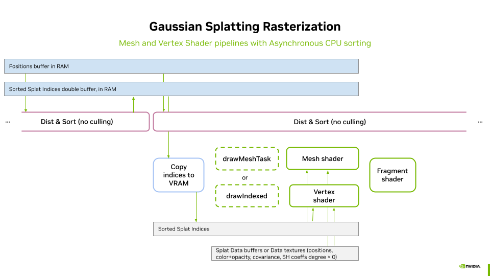
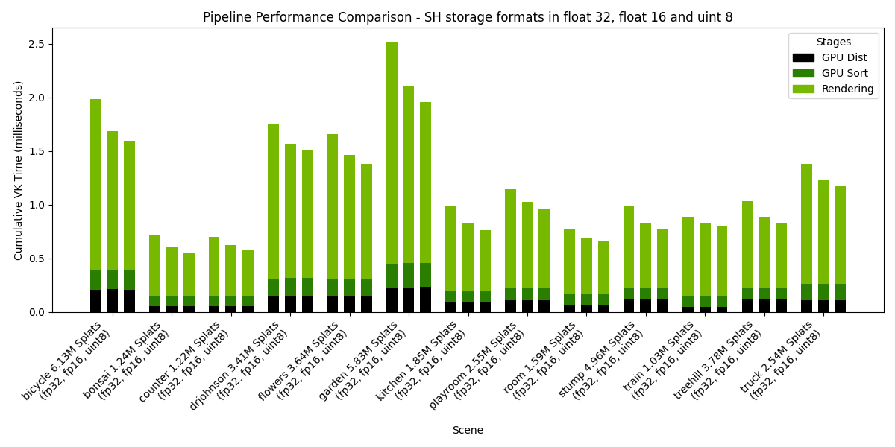
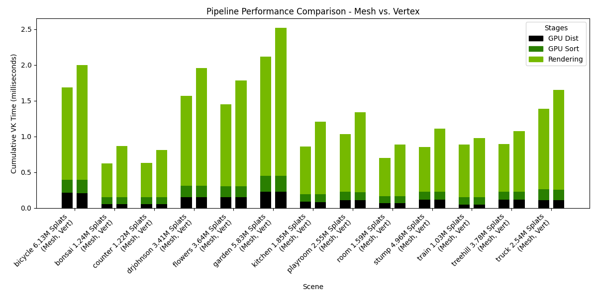

# VK3DGSR: Efficient 3D Gaussian Splatting (3DGS) [Kerbl2023] Using Vulkan Rasterization


This rendering implementation of 3DGS is based on **rasterization** and demonstrates two approaches for rendering splats: one leveraging **mesh shaders** and another utilizing **vertex shaders**. 

Since **Gaussian splats require back-to-front sorting for correct alpha compositing**, we present two alternative sorting methods. The first is a **GPU-based Radix Sort** implemented in a compute pipeline, while the second is a **CPU-based asynchronous sorting strategy** that uses the **multi-threaded sort function** from the C++ STL. 

This project serves as a **reference for efficient 3D Gaussian rendering with Vulkan**, showcasing **modern shader techniques** and **optimized sorting strategies**.

## Table of Contents

1. [Overview](#overview)
2. [Sorting Methods](#sorting-methods)
   * [Synchronous Sorting on the GPU](#synchronous-sorting-on-the-gpu)
   * [Asynchronous Sorting on the CPU](#asynchronous-sorting-on-the-cpu)
3. [Data Flow Using GPU-Based Sorting](#data-flow-using-gpu-based-sorting)
   * [Resetting the Indirect Parameters Buffer](#resetting-the-indirect-parameters-buffer)
   * [Distances Computation and Culling](#distances-computation-and-culling)
   * [Sorting via Radix Sort](#sorting-via-radix-sort)
4. [Data Flow Using CPU-Based Sorting](#data-flow-using-cpu-based-sorting)
5. [Rendering Pipelines](#rendering-pipelines)
   * [Indirect Draw Calls](#indirect-draw-calls)
   * [Direct Draw Calls](#direct-draw-calls)
   * [Vertex Shader](#vertex-shader)
     - [Vertex Shader Processing Steps](#vertex-shader-processing-steps)
   * [Fragment Shader](#fragment-shader)
   * [Mesh Shader](#mesh-shader)
     - [Shader Setup](#shader-setup)
     - [Workgroup Management](#workgroup-management)
     - [Mesh Shader Output Setup](#mesh-shader-output-setup)
     - [Vertex and Primitive Emission](#vertex-and-primitive-emission)
     - [Notes on Implementation](#notes-on-implementation)
6. [On Using a Jacobian When Rasterizing 3D Gaussian Splatting with a Perspective Camera](#on-using-a-jacobian-when-rasterizing-3d-gaussian-splatting-with-a-perspective-camera)
7. [Performance Results](#performance-results)
8. [Continue Reading](#continue-reading)
9. [References](#references)


## Overview

The visualization workflow follows these main steps:

1. Loading the 3DGS Model into RAM.
2. Data Transformation & Upload to VRAM as buffers or textures.
3. Sorting –
    * At every frame or whenever the viewpoint changes (depending on user settings and sorting method), the splats are sorted back-to-front for correct alpha compositing.
    * The resulting sorted indices are passed to the rasterization stage.
4. Rasterization –
    * For each new frame, the sorted splats are rasterized using either the Mesh Shader Pipeline or the Vertex Shader Pipeline, depending on the selected rasterization mode.

### Rendering Panel

The Rendering Panel provides controls to fine-tune the rendering process. Users can adjust the following parameters:
*	**V-Sync** – Toggles vertical synchronization on or off. Disabling V-Sync is recommended when benchmarking to obtain accurate performance measurements in the Profiler Panel.
*	**Sorting Method** – Chooses between GPU-based radix sort or CPU-based asynchronous sorting.
*	**Lazy CPU Sorting** – When the CPU Sorting Method is selected, enabling this option will trigger a new sorting pass only when the viewpoint changes. Otherwise, sorting will continuously restart as soon as the previous sorting process completes.
*	**Pipeline** – Selects the rendering pipeline, either Mesh Shader or Vertex Shader.
*	**Frustum Culling** – Defines where frustum culling is performed: in the distance compute shader, vertex shader, or mesh shader. Culling can also be disabled for performance comparisons.
*   **Frustum Dilation** – Adjusts the frustum culling bounds to account for the fact that visibility is tested only at the center of each splat, rather than its full elliptical shape. A positive value expands the frustum by the given percentage, reducing the risk of prematurely discarding splats near the frustum boundaries. More advanced culling methods are left for future work.
*	**Splat Scale** – Adjusts the size of the splats for visualization purposes.
*	**Spherical Harmonics Degree** – Sets the degree of Spherical Harmonics (SH) used for view-dependent effects:
    *	0: Disables per splat view dependence of color. Uses SH of degree 0 only.
    *	1 to 3: Enables SH of increasing degrees for improved view-dependent rendering.
*	**Show SH Only** – Removes the base color from SH degree 0, applying only color deduced from higher-degree SH to a neutral gray. This helps visualize their contribution.
*	**Disable Splatting** – Switches to point cloud mode, displaying only the splat centers. Other parameters still apply in this mode.
*	**Disable Opacity Gaussian** – Disables the alpha component of the Gaussians, making their full range visible. This helps analyze splat distribution and scales, especially when combined with Splat Scale adjustments.

## Sorting methods


### Synchronous sorting on the GPU

The GPU-based sorting process consists of two main steps:

1. **Distance Computation & Culling** – A compute shader calculates the view-space depth of each splat, converting it into an integer distance. At this stage, frustum culling can be optionally performed (enabled by default) to discard out-of-view splats early.
2. **Sorting with VRDX** – The [third-party Vulkan radix sort library (VRDX)](https://github.com/jaesung-cs/vulkan_radix_sort) is used to sort the splat indices based on the computed integer distances. This efficiently arranges the splats in a back-to-front order, ensuring correct alpha compositing during rendering.

This fully GPU-based approach leverages parallel compute capabilities for efficient sorting, minimizing CPU-GPU synchronization overhead.

### Asynchronous sorting on the CPU

The CPU-based sorting operates asynchronously in two steps:

1. **Distance Computation** – A parallel for loop computes the floating-point view-space depth of each splat.
2. **Multi-Core Sorting** – The C++ STL multi-threaded sort is used to efficiently sort the splat indices based on their computed distances.

Performance Considerations

* Slower than GPU sorting, making asynchronous execution necessary to avoid major framerate drops.
* Can introduce visible popping artifacts, but these are generally tolerable on lower-end devices, where leveraging both CPU and GPU workloads is beneficial.
* No culling is performed, as asynchronous sorting spans multiple frames. Performing culling would result in severe visual artifacts (missing splats) during camera movement.

This approach provides a viable fallback for low-end systems, albeit with some trade-offs in responsiveness and visual stability.

## Data flow using GPU based sorting


When GPU-based sorting is enabled, the `processSortingOnGPU` method (see [gaussian_splatting.cpp](../src/gaussian_splatting.cpp)) is invoked. This method adds the processings to the command buffer in three steps.

### Resetting the Indirect Parameters Buffer

In a first step, the indirect parameters buffer is reset to its default values. In particular, **instanceCount** and **groupCountX** are both set to zero. These values are initialized in a data structure, which is then copied into the buffer. 

To ensure that the indirect parameters are fully available for the next stages, a memory barrier is set at the end of this copy operation.

### Distances computation and culling

When GPU-based sorting is enabled, the compute shader responsible for distance computation and culling (see [dist.comp.glsl](../shaders/dist.comp.glsl)) is executed first. This shader stage processes the splat positions buffer or texture as input and writes to three write-only data buffers:
* Distances Buffer – Stores unsigned integer-encoded distances from the center of projection.
* Indices Buffer – Stores indices referencing sorted splats.
* Indirect Parameters Buffer – Used for issuing indirect draw calls.

Distance Computation & Culling

* For each splat, the shader computes the distance to the center of projection in view space.
* If culling is enabled, the splat center is tested against the frustum volume in normalized device coordinates (NDC) using a dilation threshold.
    * This provides an approximate and efficient culling method.
    * However, large splats near the viewport edges may cause popping artifacts due to this approximation.

Instance Index Assignment

* If the splat passes the culling test, the **instanceCount** field in the indirect parameter buffer is incremented atomically. The previous value of this field is used as an instance index.
* The distances and indices buffers are then updated for this instance index:
    * **Distances Buffer** → Stores the encoded distance to the viewpoint.
    * **Indices Buffer** → Stores the GlobalInvocationID.x as the index.
* For the Mesh Shader Pipeline, an additional step is performed, 
    * the **groupCountX** field in the indirect parameters buffer is incremented for every WORK_GROUP_SIZE visible splats, using an atomic add. These parameters will be devised in section Mesh shader.

At the end of this process:

* Both buffers are filled from index 0 to number of visible splats.
* The index buffer will later be used to dereference splat attributes for rendering.
* The indirect parameter buffer contains updated instanceCount and groupCountX=(instanceCount + WORK_GROUP_SIZE - 1) / WORK_GROUP_SIZE

A memory barrier is set at the end of this process to ensure that the splat distances and indices are fully available to the Radix Sort compute pipeline before execution.

### Sorting via Radix Sort

The pipeline is invoked using the **instanceCount** value stored in the **indirect parameters buffer**, which was previously incremented during the **distance computation stage**. The process remains fully **GPU-driven**, as the **indirect buffer eliminates the need for CPU readback or control**. The sorting operation is performed **in-place**, meaning the **indices buffer is directly reordered** based on the computed distances. Once sorting is complete, the **sorted indices buffer** is ready for rendering, ensuring that splats are processed **back-to-front** for correct **alpha compositing**.

Since we use the third-party Vulkan Radix Sort library from [jaesung-cs/vulkan_radix_sort](https://github.com/jaesung-cs/vulkan_radix_sort), we will not go into detail describing the radix sort pipeline. However, those interested can refer to the github project, where the implementation resides.

Finally, a last memory barrier is added to ensure the availability of the sorted indices buffer for the stages of the graphics pipeline.

## Data Flow Using CPU-Based Sorting  

  

The **CPU-based sorting** is executed in a **separate thread**, with its implementation residing in the **`innerSort`** method (see [splat_sorter_async.cpp](../src/splat_sorter_async.cpp#L81)). The **rendering loop** controls both the **start of a new sort** (triggered when sorting is idle and the camera changes) and the **consumption of sorted indices**. This logic is implemented in the **`tryConsumeAndUploadCpuSortingResult`** method (see [gaussian_splatting.cpp](../src/gaussian_splatting.cpp#L206)).

Within this method, executed by the main thread (rendering loop):

- If a **sorted indices buffer** is available, the **double buffer** is swapped via **pointer interchange**.  
- If the **viewpoint has changed** since the last frame, a **new sort is immediately restarted** to run in parallel, minimizing latency and ensuring the next sorting process starts as soon as possible.  
- The **previously sorted buffer** is then **copied to VRAM**.  
- A **memory barrier** is set at the end of this process to ensure that the **splat indices are fully available** for the **graphics pipeline stages**.

## Rendering Pipelines  

The rasterization of the splats is performed using geometry instancing of a simple quad (one quad instance per splat). Geometry instancing enables a compact geometry description in VRAM. Each quad instance is screen-aligned and scaled using its associated covariance matrix, which is applied inside either the mesh shader or the vertex shader, depending on the selected pipeline.  

We implement geometry instancing in two ways:  

1. **Vertex Shader Pipeline** → Uses traditional instanced rendering, triggered by a call to `vkCmdDrawIndexed` or `vkCmdDrawIndexedIndirect`, with the number of instances passed as a parameter.  
2. **Mesh Shader Pipeline** → Uses mesh shaders to generate and render quads dynamically. The mesh shaders are trigerred by a call to, `vkCmdDrawMeshTask` or `vkCmdDrawMeshTaskIndirect`, with the number of **workgroups** to use for the generation.

> **Note**: Geometry instancing could also be implemented using **Geometry Shaders** to generate the quads, but this would not be as performant as with **Mesh Shaders**.  

### Indirect Draw Calls  

When **sorting is performed on the GPU**, both distance computation and sorting remain entirely on the GPU. Therefore, indirect draw calls are used to invoke the graphics pipeline, ensuring that the entire process is GPU-driven without requiring CPU intervention. The **indirect parameters buffer** acts as the bridge, providing the necessary parameters to drive the selected graphics pipeline.  

- **Vertex Shader Pipeline** → The `instanceCount` field in the indirect parameters buffer determines the number of instances to be processed by `vkCmdDrawIndexedIndirect`.  
- **Mesh Shader Pipeline** → The `groupCountX` field in the indirect parameters buffer specifies the number of groups to be processed by `vkCmdDrawMeshTaskIndirect`.  

This approach ensures that the rendering process is fully dynamic and efficient, with the number of instances or groups automatically adapting to the number of visible splats after sorting.  

### Direct Draw Calls  

When **sorting is performed on the CPU**, the instance or group count is passed as a parameter to **direct draw calls** to drive the selected graphics pipeline. Since **no culling** is applied during the sorting process, **all splats** are always instantiated. However, culling can still be applied during the rasterization stage.

- **Vertex Shader Pipeline** → The `instanceCount`, which is always set to the total number of splats, is passed as a parameter of `vkCmdDrawIndexed`.  
- **Mesh Shader Pipeline** → The `groupCountX` parameter of `vkCmdDrawMeshTaskIndirect` is set to `(total number of splats + WORK_GROUP_SIZE - 1) / WORK_GROUP_SIZE`, with `Y` and `Z` set to `1`.  

The `WORK_GROUP_SIZE` value will be discussed in the **Mesh Shader** section.

### Vertex Shader  

The vertex shader is implemented in [raster.vert.glsl](../shaders/raster.vert.glsl). The code has been adapted to **Vulkan** from the **WebGL-based** implementation by [mkkellogg/GaussianSplats3D](https://github.com/mkkellogg/GaussianSplats3D). Some mathematical formulations and comments have been directly retained from this source.

The vertex shader operates on each of the **four vertices** of each quad. Since the input quad has **normalized 2D positions** in the range **[-1,1]**, the shader does not need to distinguish between individual vertices. Instead, the transformation—derived from the **splat position** and **covariance matrix**—determines the final scale and placement of the splat.  

The **same color and opacity** (computed from **Spherical Harmonics (SH) coefficients** and the viewpoint position) are assigned to all four vertices of the quad. The shader outputs:  
- The **final vertex position** in `gl_Position`.  
- The **normalized vertex position** in `outFragPos` (the original normalized 2D position).  
- The **splat color and opacity** for the given view direction in `outFragCol`.  

#### **Vertex Shader Processing Steps**  

1. **Transform the splat position** into view space.  
2. **Perform culling** (if enabled at this stage) against the **Normalized Device Coordinates (NDC)**.  
   - If the splat is culled, it is discarded by generating **degenerate triangles** (all vertices receive the same `gl_Position`), followed by an **early return**.  
3. **Set `fragPos`** as early as possible to optimize parallel output writes.  
4. **Compute the splat color and opacity** using **viewpoint position** and **SH attributes**.  
5. **Perform opacity-based culling**:  
   - If the computed opacity is below a threshold, the splat is discarded via an **early return**.  
6. **Set `fragCol`** as early as possible to optimize parallel output writes.  
7. **Transform the 3D covariance matrix**:  
   - Convert the **3D covariance matrix** into **2D** using the **model-view matrix**.  
   - Use the eigen vectors of this transformed **2D covariance matrix** to compute the final **vertex position**.  
8. **Write the final vertex position** to `gl_Position`.

### Fragment Shader  

The fragment shader is implemented in [**raster.frag.glsl**](shaders/raster.frag.glsl).  

It is designed to be extremely **lightweight**, as most computations are already handled in the **vertex shader**. Since **Gaussian Splatting** is inherently **fragment-intensive**, minimizing the workload in this stage is crucial for performance.  

The fragment shader operates as follows:  
1. It uses the interpolated value of **`inFragPos`** to compute the **positional squared distance `A`** from the center of the splat to the current fragment.  
2. If the fragment lies **outside the ellipse** defined by the **rectangle formed by `inFragPos`**, it is **discarded**.  
3. The **opacity is updated** based on `A` using the **Gaussian formula**.  
4. The **final color** (including the updated opacity) is written to `outColor`, using the splat color from **`inSplatCol`**.  

### Mesh shader

The mesh shader is implemented in [**raster.mesh.glsl**](shaders/raster.mesh.glsl). Compared to the vertex shader approach, most processing (culling, color computation, projection) is performed per splat rather than per vertex, significantly improving efficiency. The key aspects of the mesh shader are outlined below.

#### Shader Setup

* Requires Vulkan mesh shading extension `GL_EXT_mesh_shader`
* Uses a workgroup size of 32 (layout(local_size_x = 32, local_size_y = 1, local_size_z = 1) in;). 
    * This configuration is optimized for NVIDIA hardware.
* Outputs triangles, with a maximum of 128 vertices and 64 primitives per workgroup.

#### Workgroup Management

* Parallel Processing: Each global invocation (thread) processes **one splat**.
* Batch Processing: The workgroup can process up to **32 splats** (outputQuadCount).

#### Mesh Shader Output Setup

* The first thread (gl_LocalInvocationIndex == 0) sets the total number of **vertices and primitives** for the workgroup using:
    
     `SetMeshOutputsEXT(outputQuadCount * 4, outputQuadCount * 2);`

* Each **splat** emits a **quad** (4 vertices, 2 triangles).

#### Vertex and Primitive Emission

* Each quad is defined in local space with:

    `const vec2 positions[4] = {{-1.0, -1.0}, {1.0, -1.0}, {1.0, 1.0}, {-1.0, 1.0}};`

* Outputs per-vertex attributes as early as possible (outFragPos).
* Assigns triangle indices to form two triangles per quad:

    `gl_PrimitiveTriangleIndicesEXT[...] = uvec3(...);`

#### Notes on implementation

This version of the **Mesh Shader** is optimized for cases where **culling is performed in a previous stage**, meaning the number of outputs for each workgroup is **known at the beginning of execution**.  

When performing **culling inside the Mesh Shader**, further optimizations are possible by using the `GL_NV_mesh_shader` extension instead of `GL_EXT_mesh_shader`. This extension allows **setting the number of workgroup outputs at the end of execution**, ensuring the exact number of primitives emitted.  

In this scenario, the `shader_subgroup` extension is required to **compute ballots** efficiently. A version implementing this approach is reserved for **future work**.  

### On Using a Jacobian When Rasterizing 3D Gaussian Splatting with a Perspective Camera

When rasterizing 3D Gaussian splatting with a perspective camera, the Jacobian matrix is used to correctly account for how the 3D Gaussian transforms when projected onto the 2D image plane. This ensures accurate splat shape and size in screen space.

In 3D space, Gaussians are typically represented as ellipsoids with a mean position **μ** and a covariance matrix **Σ**. When projecting to 2D, the shape of these Gaussians warps non-linearly due to perspective effects. The Jacobian matrix **J** of the projection function encodes how infinitesimal changes in 3D coordinates affect the 2D screen-space coordinates.

The covariance matrix **Σ** of a Gaussian describes its shape in 3D. When projected onto the image plane, we need to compute the new 2D covariance **Σ'**, which is given by:

    Σ' = J * Σ * transpose(J)

This operation preserves the anisotropic shape of the Gaussian in screen space. Without it, Gaussians would appear incorrectly shaped after projection. This step is not needed with an orthographic camera. For a complete mathematical explanation, refer to [Zwicker2002].

## Performance results

To run the benchmark, you need to have the INRIA dataset located in folder <path_to_3dgs_dataset_root>.

You may need to install additional python dependencies such as:

``` sh
python -m pip install matplotlib
```

Then run the benchmark using the following command:

```
python benchmark.py benchmark_3dgs.cfg 3DGS <path_to_3dgs_dataset_root> benchmark_results_3dgs.csv
```

The following charts presents the results of such a benchmark, when run on an `NVIDIA RTX 6000 Ada Generation`, drivers version 572.64.0, Intel(R) Core(TM) i9-14900K, 3200Mhz, 24 Cores, 32 Logical Processors. The rendering resolution was 1920x1080.

Settings: Storage=Buffers, Pipeline=Mesh, SH Format=**variable**, Rendering SH degree=3, Culling at distance stage.




Settings: Storage=Buffers, Pipeline=**variable**, SH Format=float32, **Rendering SH degree=3**, Culling at distance stage.


Settings: Storage=Buffers, Pipeline=**variable**, SH Format=float32, **Rendering SH degree=2**, Culling at distance stage.



Settings: Storage=Buffers, Pipeline=**variable**, SH Format=float32, **Rendering SH degree=1**, Culling at distance stage.


## Continue Reading

1. [VK3DGRT: 3D Gaussian Ray Tracing (3DGRT) [Moënne-Loccoz2024] using Vulkan RTX](./ray_tracing_3d_gaussians.md)
2. [VK3DGHR: 3D Gaussians Hybrid Rendering Using Vulkan RTX and Rasterization](./hybrid_rendering_3d_gaussians.md)

## References

Please consult the consolidated [References](../readme.md#References) section of the main `readme.md`.

