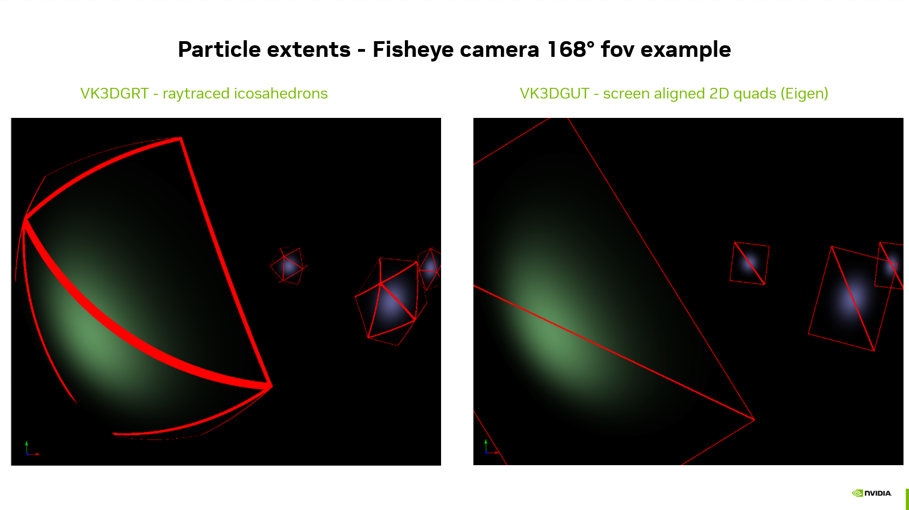

# VK3DGUT: Efficient 3D Gaussian Unscented Transform (3DGUT) [Wu2024] Using Vulkan Rasterization


3D Gaussian Splatting [Kerbl2023] (3DGS) rasterization with global sorting is highly efficient in terms of rendering performance but is feature-limited. 3D Gaussian Ray Tracing [Moënne-Loccoz2024] (3DGRT) opens up more possibilities, such as fisheye lenses, rolling shutters, depth of field, fast shadows, etc. However, the ray tracing approach presents lower rendering frame rates.

3D Gaussian Unscented Transform [Wu2024] (3DGUT) introduces a new method for computing splat projections, allowing for fisheye effects, rolling shutters, and depth of field using a rasterization approach. This results in higher rendering performance for primary rays. Some other effects, such as computing shadows at primary ray intersections, remain the domain of ray tracing.

We implement VK3DGUT on the same infrastructure as the "Raster mesh shader 3DGS" pipeline (see [VK3DGS](./rasterization_of_3d_gaussian_splatting.md)) and replace the Elliptical Weighted Average (EWA) projections from 3DGS with the new Unscented Transform (UT) projection from 3DGUT. For mathematical details, please refer to the 3DGUT publication [[Wu2024](https://research.nvidia.com/labs/toronto-ai/3DGUT/)].


## Table of Contents

1. [Implementation Details](#implementation-details)
   * [Mesh Shader](#mesh-shader)
   * [Fragment Shader](#fragment-shader)
   * [Adaptation for Temporal Multi-Sampling](#adaptation-for-temporal-multi-sampling)
2. [Current Limitations](#current-limitations)
3. [Performance Results](#performance-results)
4. [Continue Reading](#continue-reading)
5. [References](#references)

## Implementation Details

We have added a new renderer pipeline named **"Raster mesh shader 3DGUT"** in the Renderer parameters. Although we did not create a vertex shader version, it would be straightforward to do so by starting from the VK3DGS version and making the necessary updates, similar to what we did for the mesh shader variant. The new pipeline is built using two new shader files: [threedgut_raster.mesh.glsl](../shaders/threedgut_raster.mesh.glsl) and [threedgut_raster.frag.glsl](../shaders/threedgut_raster.frag.glsl). The projections functions functions are found in [threedgut.glsl](../shaders/threedgut.glsl) and other glsl files prefixed by "threedgut".

### Mesh Shader

The mesh shader [threedgut_raster.mesh.glsl](../shaders/threedgut_raster.mesh.glsl) is based on [threedgs_raster.mesh.glsl](../shaders/threedgs_raster.mesh.glsl). It replaces the EWA projection with the UT one. The projection is computed in two steps:

1. We compute the covariance using the function `threedgutParticleProjection` (defined in the file [threedgut.glsl](../shaders/threedgut.glsl)).

2. We compute the rectangular 2D bounding box (the projection extent) to emit a screen-aligned quad with the proper extent:

   a. If **"Projection Method > Conic"** is selected, use the function `threedgutProjectedExtentConicOpacity` (also defined in the file [threedgut.glsl](../shaders/threedgut.glsl)).

   b. If **"Projection Method > Eigen"** is selected, use the function `threedgsProjectedExtentBasis` (defined in the file [threedgs.glsl](../shaders/threedgs.glsl)).

The **Conic** extent method is comparable to the approach used in the original 3DGS paper for finding the rectangular bounding box of the projection. This bounding box is then used in both 3DGS and 3DGUT to rasterize using CUDA. The version presented here is adapted from the CUDA code of 3DGUT.

It differs from the **Eigen** approach also used in the VK3DGS implementation, where we use the eigenvalues and eigenvectors of the 2D covariance matrix to determine the 2D basis for the splat. This leads to non-axis-aligned rectangular 2D extents that, in some cases, better fit the particles and prevent rasterizing many fragments with negligible or zero contributions (see comments in [threedgs.glsl](../shaders/threedgs.glsl)). 

As can be seen in the [Performance Results](#performance-results) section, both approaches tend to be comparable in terms of performance. Although we did not conduct extensive tests, an image comparison of the Bicycle model's default view between **Conic** (considered the reference) and **Eigen** yields a PSNR of 52.83 dB, meaning that the Eigen approach is also highly accurate. The minor differences arise from slight threshold variations between the two implementations.


The quad is finally emitted (as two triangles) with the following per-face attributes to avoid data fetches in the fragment shader:

* `splatCenter`, `splatScale`, and `splatRotation`
* `splatColor`, which is evaluated using the view position and the particle center as described in the original 3DGS paper

The opacity is then evaluated per fragment in the fragment shader using the provided information and the primary ray associated with the pixel.

### Fragment Shader

The fragment shader [threedgut_raster.frag.glsl](../shaders/threedgut_raster.frag.glsl) is quite different from the VK3DGS one (see [threedgs_raster.frag.glsl](../shaders/threedgs_raster.frag.glsl)), which only performs interpolations.

In this new fragment shader, we evaluate, for each fragment of each emitted particle screen quad, the intersection of the associated primary ray and the particle using the particle intersection from 3DGRT.

We first compute the primary ray for the given fragment according to the camera model using `generatePinholeRay` or `generateFisheyeRay` (functions defined in [cameras.glsl](../shaders/cameras.glsl)).

We then apply ray perturbation if the **depth of field** effect is activated, using the `depthOfField` function (also defined in [cameras.glsl](../shaders/cameras.glsl)).

We finally evaluate the ray/particle intersection using the function `particleProcessHitGut`, adapted from VK3DGRT (see [threedgrt.glsl](../shaders/threedgrt.glsl)). The core of this function is similar to the VK3DGRT version (see `particleProcessHit` in the same file). We perform two adaptations for VK3DGUT:

* The new function only returns the evaluated opacity for the fragment instead of performing the blending with previous radiance values. The blending is handled by the alpha blending mechanism of the Vulkan rasterization pipeline (recall that splats are sorted back to front prior to rasterization).
* Additionally, the VK3DGRT version of the function performs the particle data fetch, whereas in this new VK3DGUT version, we use the values provided by the mesh shader, passed as function parameters through triangle attributes. This approach ensures that fetches are done once per particle instead of once per fragment, which is critical for performance.

The following image clearly shows the deformations of the particles (the green one being the most visually obvious) in extreme fisheye conditions, thanks to the ray/particle evaluation and the proper adaptation of the 2D extent.



> **Note**: We currently compute/generate these rays per **fragment** (whereas in the raytracer, we do it per **pixel**), resulting in multiple computations per pixel for each particle projection that covers the pixel. We could consider preparing a ray buffer with these per-pixel rays in a pre-pass, which could potentially accelerate the execution of the fragment shader. However, while this approach would reduce the cost of mathematical evaluations, it would come with the trade-offs of increased memory storage, pre-pass execution time, synchronization, and data fetches (which is also a costly operation) in the fragment shader. This is left as an interesting exercise for the reader.

### Adaptation for Temporal Multi-Sampling

The depth of field effect is achieved by applying pseudo-random perturbations to the primary rays to sample the diaphragm aperture (see [depth of field in VK3DGRT](./ray_tracing_3d_gaussians.md#depth-of-field)). 


One primary ray is cast per pixel and per frame. Similar to the ray tracing approach, in order to obtain a converged, denoised image (without using a denoiser), it is necessary to accumulate the results of several frames (or several samples per frame).

In the VK3DGRT ray tracing pipeline, this temporal accumulation is directly performed in the ray generation shader, which reads the color of the pixel from the previous frame in the framebuffer and mixes this value with the current frame pixel color before writing it back to the color buffer.

With rasterization, we cannot do this in the fragment shader since we already use alpha blending to blend the fragments of the current frame and we do not want to perform fetches from the framebuffer in the fragment shader for performance reasons. Therefore, we **use two color buffers**: one to render the current frame and one to store the accumulated frames, with the latter being displayed to the viewport. At each new frame with index > 0, the accumulation is performed in a simple new post-processing compute shader [post.comp.glsl](../shaders/post.comp.glsl) using the current frame index as for ray tracing. Frame numbering restarts on scene or camera changes and stops when the number of samples is reached (**"Temporal samples count"** in the **"Ray tracing and 3DGUT specifics"** tab of the renderer).

### Current Limitations

The support for depth of field (DoF) is limited in the current implementation. While we properly perform the ray perturbation in the fragment shader, we should introduce a particle dilation proportional to the DoF parameters and the distance to the focal point in the mesh shader during the projection. Due to this missing part, some rays that should intersect a particle are not evaluated because they are initiated by a pixel that is not covered by the particle's projected extent.

This can visually manifest in the comparative image of the previous section. For example, looking at the chimney, you can observe a squared effect in the defocused areas due to the "clamp" introduced by the limited extent. Another artifact, seen during the first frames of sampling or when using only a few sampling frames, is a noticeable energy loss, resulting in a slightly darker final image. This darkening artifact vanishes, however, after enough samples are accumulated to compensate for the rays that are "missed" at each frame. 

Support for this dilation is left for future work.

## Performance Results

To run the benchmark, you need to have the 3DGRT dataset located in folder <path_to_3DGRT_dataset_root>.

You may need to install additional python dependencies such as:

``` sh
python -m pip install matplotlib
```

Then run the benchmark using the following command:

``` sh
python benchmark.py benchmark_3dgut.cfg 3DGUT <path_to_3DGRT_dataset_root> benchmark_results_3dgut.csv
```

This benchmark evaluates the Vulkan rendering time per frame and the frame rate which includes the presentation time. Only primary rays are rendered, with no effects, no mesh insertion, and using a pinhole camera.

The following charts presents the results of this benchmark, when run on an `NVIDIA RTX 6000 Ada Generation`, drivers version 576.8.0, Intel(R) Core(TM) i9-14900K, 3200Mhz, 24 Cores, 32 Logical Processors. The rendering resolution was 1920x1080.

 

 

## Acknowledgment

Thanks to Qi Wu (@wilsonCernWq) for generating the 3DGUT dataset for us. Thanks to Nicolas Moënne-Loccoz (@moennen) for the great discussions around 3DGUT.

## Continue Reading

1. [VK3DGHR: 3D Gaussians Hybrid Rendering Using Vulkan RTX and Rasterization](./hybrid_rendering_3d_gaussians.md)

## References

Please consult the consolidated [References](../readme.md#References) section of the main `readme.md`.

