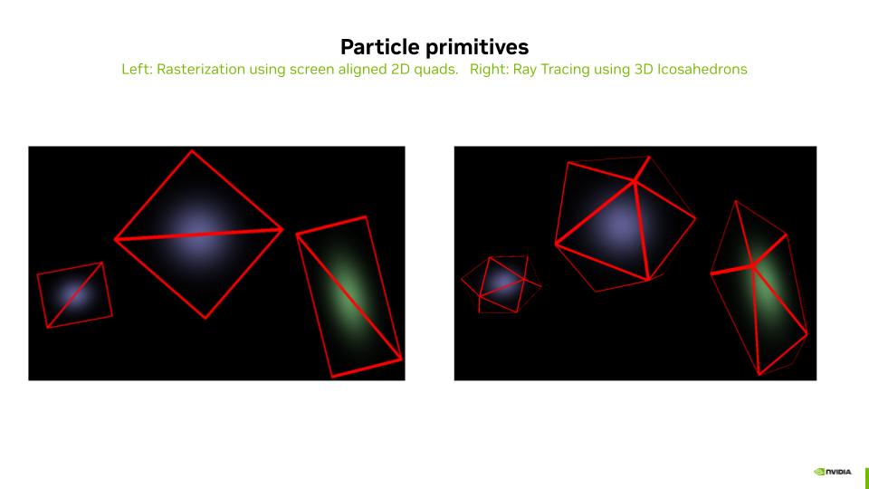
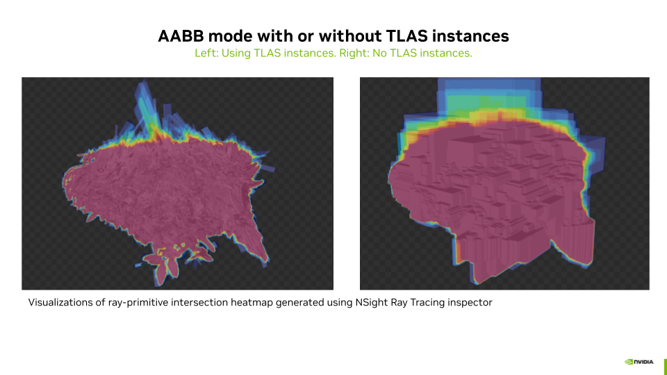

# VK3DGRT: Efficient 3D Gaussian Ray Tracing (3DGRT) [Moënne-Loccoz2024] using Vulkan RTX

  

We implement the rendering algorithm of 3D Gaussian Ray Tracing (3DGRT) as described in [Moënne-Loccoz2024] using the Vulkan Ray Tracing (RTX) extension.

## Table of Contents

1. [Principle](#principle)
2. [Any Hit Based Implementation](#any-hit-based-implementation)
3. [Acceleration Structures](#acceleration-structures)
4. [Compositing with 3D Meshes and Secondary Rays](#compositing-with-3d-meshes-and-secondary-rays)
5. [Performance Results](#performance-results)
6. [Continue Reading](#continue-reading)
7. [References](#references)

## Principle

As with 3DGS [Kerbl2023], the compositing of radiance for each particle intersection, for a given pixel of the image, must be performed in an ordered manner. For performance reasons, this compositing, unlike rasterization, is performed front-to-back and stops whenever a transmittance threshold is reached. This approach helps reduce computational cost by discarding far particles that do not contribute significantly to the final pixel color.

Unlike [VK3DGSR](rasterization_of_3d_gaussian_splatting.md), where screen-aligned 2D quads are used to render the particles, the ray tracing variant solves the particle intersection in 3D space, using a 3D volume to describe the particle.

  

To compute the intersections between rays and particles, each particle is defined using either:
* A bounding volume defined by a **3D mesh of an icosahedron**, or
* A bounding volume defined by a **3D Axis Aligned Bounding Box (AABB)**.


**In the case of the Icosahedron 3D Mesh**, the intersection is computed by the built-in Traversal and Triangle Intersection Unit (TTU):
* The TTU is a hardware unit designed to accelerate the process of traversing acceleration structures (such as BVH – Bounding Volume Hierarchies) and performing ray-triangle intersection tests, which are critical operations in ray tracing. This specialized unit helps improve the performance and efficiency of ray tracing computations on GPUs.

**In the case of the AABB**, the intersection is computed using a programmable intersection shader that implements parametric intersection with the particle ellipsoid.

## Any Hit Based Implementation

To compute the ordered set of particle intersections for a given ray, one could use a **closest hit shader** invoked multiple times by the **ray generation shader**. Starting from $tMin$, find the closest particle hit, then restart a trace from this point, and continue until the transmittance (initialized to 1.0) lowers to a given threshold $minTransmittance$. While this implementation is functional, it **comes at a very high computational cost** since the ray generator must trace as many rays per pixel as intersected particles.

To overcome this issue, [Moënne-Loccoz2024] proposes using the **any hit shader** instead of the **closest hit shader** to reduce the number of rays traced by the ray generation shader.

The Ray Payload (also known as Per Ray Data - PRD) is used to exchange data between the **hit shader** and the **ray generation shader** (using `rayPayloadEXT`/`rayPayloadInEXT`). Instead of storing the result of one intersection as one would do when using a closest hit, a sorted array of $K$ intersections is stored in the payload. For each intersection, the any hit shader tests if the new particle intersection (which may come in any order) should be inserted in the array using simple insertion sort. The farther intersection of the array might be discarded in the process. After tracing one ray, the payload array contains a subset of $k \leq K$ nearest particles sorted front to back. The **ray generation shader** computes the particle response using a 3D Gaussian and the particle properties, and performs the compositing of the computed radiances for each intersected particle. It then reruns the tracing of a new ray starting from the last intersected particle of the previous run if needed (if $minTransmittance$ is not reached and $k = K$). And so on.


The example of the above diagram is developed hereafter:
* We configure the Ray Payload as an array of intersection results containing a distance and a particle ID.
    * Let $K$ be the maximum number of results that can be stored in the array of intersections.
* In this example, three rays are traced by the ray generation (raygen) shader (for the same pixel).
    * Before each `traceRayEXT` call, each entry of the payload array is reset to infinite distance.
* Each `traceRayEXT` of index $n$ will systematically go:
    * Through all the splats between $Tmin_n$ and $Tmax_n$, invoking the **any hit shader** for each intersection.
    * The **any hit shader** handles the insertion and sorting of the $k \leq K$ closest particles within the payload buffer.
* After each ray trace, the raygen shader (using the `processHit` function, see file `raytrace.rgen.glsl`):
    * Computes the radiance of each intersected splat and blends the result to the pixel radiance.
    * The $transmittance$ is decreased by the opacity of the blended values.
    * $Tmin_{n+1}$ is set to the distance to the last intersected splat.
* At the third ray trace, a minimum $transmittance$ is reached, and the raygen shader stops issuing `traceRayEXT` calls.

## Acceleration Structures

The parameters to control the generation of the ray tracing acceleration structures are found in the Properties panel of "**Assets > Radiance Fields > SplatSet**".


The particle primitives can be described using the two approaches mentioned above:
* **Use AABBs**: *Enabled* activates the use of a procedural intersection shader.
* **Use AABBs**: *Disabled* activates the use of an Icosahedron 3D Mesh and built-in TTU intersection.

The ray acceleration structures (AS) can be built with different approaches:
* **Use TLAS Instances**: *Enabled* will generate ASs where the geometry of a single unit particle is stored in a Bottom Level Acceleration Structure (BLAS) and where the Top Level Acceleration Structure (TLAS) contains as many instances of the BLAS as there are particles, each instance having an associated transformation matrix. 
* **Use TLAS Instances**: *Disabled* will generate ASs where the geometry of all the particles transformed in global coordinates is stored in a Bottom Level Acceleration Structure (BLAS) and where the Top Level Acceleration Structure (TLAS) contains a single instance of this BLAS.



*Activating* **Use AABBs** *together with deactivating* **Use TLAS Instances** leads to BLAS containing massive AABB overlap, due to the fact that AABBs of particles transformed to their world coordinates can become very large. This configuration leads to extremely slow ray tracing performance, possibly leading to a Device Lost error. This is not the case when using instances since there is only one AABB that is then transformed by the instance matrix into a non-axis-aligned box. **This combination is thus disabled in the GUI**.

Finally, the **BLAS compaction** option allows compressing the BLAS, which leads to more compact BLAS in memory and also to better ray tracing performance.

## Compositing with 3D Meshes and Secondary Rays

The provided implementation allows composing scenes with 3D meshes and a particle set. For this, the ray tracing loop is extended so that meshes occlude particles placed behind them and are overlaid by closer particles. To do so efficiently, the meshes are stored in a separate acceleration structure (`topLevelASMesh` in the file `raytrace.rgen.glsl`).

1. The meshes are traced before the particle set. While particle sets make use of the `any hit shader`, the 3D meshes use the `closest hit shader` of the same pipeline. In case of a hit, the `closest hit shader` uses the same payload array to return the distance $meshHitDist$ to the intersection, the object ID, the material ID of the object, the position, and the normal of the intersection point in world coordinates. These are stored for later use, and shading of the mesh is postponed. In this way, if some particles in front of the mesh are opaque enough, the shading of the mesh (including potential secondary rays evaluations) will not be computed for better performance.
2. The tracing of the particles acceleration structure (`topLevelAS`) occurs from $min$ to $meshHitDist$. This prevents the need for costly tracing of particles placed behind the mesh if any. The $radiance$ for this pixel is updated by the `processHit` function as described in the previous section.
3. Finally, if $meshHitDist$ is not infinite (there was a hit) and if minimum $transmittance$ is not reeached due to particles located in front of the mesh (step 2), the shading of the mesh is computed for this intersection, using the set of lights (point or directional), and composed with the $radiance$. This task is performed by the `processMeshHit` function. If the material of the object that was hit is reflective or refractive, a `done` flag is set to false, and a new `rayOrigin` and `rayDirection` are computed for the tracing of a **secondary ray**.
4. Then the main loop restarts the same tasks with the secondary ray, adding the resulting partial radiance coming from reflections or refractions to the final pixel radiance. The main loop ends when no more mesh is hit or when the maximum number of bounces is reached.

## Performances Results

To run the benchmark, you need to have the 3DGRT dataset located in folder <path_to_3DGRT_dataset_root>.

You may need to install additional python dependencies such as:

``` sh
python -m pip install matplotlib
```

Then run the benchmark using the following command:

``` sh
python benchmark.py benchmark_3dgrt.cfg 3DGRT <path_to_3DGRT_dataset_root> benchmark_results_3dgrt.csv
```

The following charts presents the results of such a benchmark, when run on an `NVIDIA RTX 6000 Ada Generation`, drivers version 572.64.0, Intel(R) Core(TM) i9-14900K, 3200Mhz, 24 Cores, 32 Logical Processors. The rendering resolution was 1920x1080.

 

## Acknowledgment

Thanks to Qi Wu (@wilsonCernWq) for generating the 3DGRT dataset for us. Thanks to Nicolas Moënne-Loccoz (@moennen) for the great discussions around 3DGRT.

## Continue Reading

1. [VK3DGHR: 3D Gaussians Hybrid Rendering Using Vulkan RTX and Rasterization](./hybrid_rendering_3d_gaussians.md)

## References

Please consult the consolidated [References](../readme.md#References) section of the main `readme.md`.
