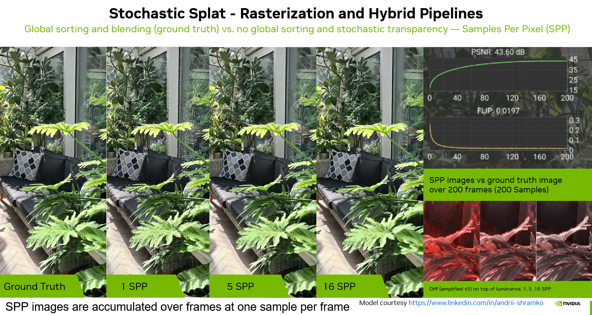
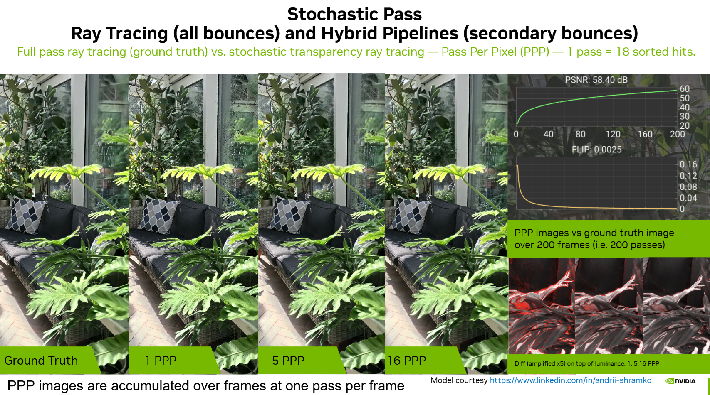

# Stochastic transparency

By removing the need for sorting the particle intersections, stochastic transparency [Enderton2010] improves interactivity. This comes at the cost of noisy results, which can be mitigated by temporal accumulation or denoising methods. The methods presented hereafter are unbiased: accumulating enough samples will lead to visual results identical to the full sorting approach.

In the first section, we present how to apply Stochastic Splat [Kheradmand2025] to the rasterization pipelines. The second section describes the deterministic baseline of the ray tracing pipeline. In the third, we describe how we adapt stochastic transparency to the any-hit shader itself, replacing bubble-sort insertion with Monte Carlo sample picking so that a single `traceRay` call per pixel suffices. In the fourth, we describe a coarser-grained variant that keeps the per-pass sorting but stochastically terminates the pass loop early, skipping some passes compared to the full any-hit approach.

Note that stochastic transparency approaches also have an impact on the results of lighting and shadowing; this is discussed in detail in the [Lighting, Shading and Shadows](./lighting_and_shadows.md) page.

Note that using accumulation mode over more than 150–200 frames may require switching the renderer output color format to FP32 precision for proper results. The default is set to FP16 (see **Renderer > Properties > Color Format**). Also note that when temporal accumulation is not needed, switching to UINT8 will increase rendering speed.

## Table of Contents

1. [Rasterization - Stochastic Splat [Kheradmand2025]](#1-rasterization---stochastic-splat-kheradmand2025)
2. [Ray Tracing - Deterministic Termination (Baseline)](#2-ray-tracing---deterministic-termination-baseline)
3. [Ray Tracing - Stochastic Any Hit](#3-ray-tracing---stochastic-any-hit)
4. [Ray Tracing - Stochastic Pass](#4-ray-tracing---stochastic-pass-sorting-free-analogue-at-pass-granularity)

## 1. Rasterization - Stochastic Splat [Kheradmand2025]



A rasterization or a hybrid pipeline must be active (only applies to primary rays).

**Renderer > Properties > Rasterization > Sorting Method > Stochastic Splat**

StochasticSplats [Kheradmand2025] is a stochastic transparency approach [Enderton2010] to 3D Gaussian splatting that replaces the usual sorted alpha-blending pipeline with a Monte Carlo estimator, allowing splats to be rasterized without global depth sorting. Instead of compositing many semi-transparent contributions in strict back-to-front order, the renderer stochastically accepts fragments (treating accepted ones as fully opaque samples) with probability related to each splat’s opacity, relies on the standard depth test for visibility, and then averages many independent samples to approximate the expected transparent result. In practice, samples can be accumulated within a frame via MSAA and/or across frames via temporal accumulation, giving a straightforward quality–performance knob: low sample counts are fast but noisy, while increasing the number of samples converges quickly and remains unbiased in expectation. The paper provides the mathematical details; the key takeaway here is sorting-free rasterization with a controllable trade-off between interactivity and quality. To further improve temporal stability and reduce popping, the method also proposes orienting splat billboards using a maximum-density plane rather than the usual camera-facing approximation.

In our implementation, we adopted the Monte Carlo stochastic fragment-rejection (“stochastic discard”) approach across all raster pipelines. Hybrid pipelines can also benefit from it on the primary rays, where pixel radiance is integrated in the raster pass. MSAA-based sampling and maximum-density-plane billboards are left for future work. When Stochastic Splat mode is enabled:
* the raster pipelines systematically skip the global sorting step,
* alpha blending is disabled (accepted samples are written as fully opaque),
* and depth testing + depth writes are enabled to resolve visibility via the Z-buffer.

The following fragment-stage excerpt from [threedgs_raster.frag.slang](../shaders/threedgs_raster.frag.slang) implements stochastic fragment rejection (“stochastic discard”): a per-fragment random number is compared against the splat opacity; accepted fragments write an opaque color, while rejected fragments are discarded.

``` c 
uint seed       = xxhash32(uint3(uint(fragCoord.x), uint(fragCoord.y), frameInfo.frameSampleId));
seed            = xxhash32(uint3(seed, splatId, primitiveID));
float randomVal = rand(seed);

if(randomVal < opacity)
{
  output.outColor = float4(inSplatCol.rgb, 1.0);
  return output; 
}
else
{
   discard;
}
```

For this to behave well, the random generator must be seeded with **well-decorrelated** values to avoid structured noise and temporal artifacts. We build the seed by hashing the integer pixel coordinates \((x,y)\), the per-frame sample id (to vary the pattern over time for temporal accumulation), the `splatId` (critical to decorrelate contributions across splats), and the `primitiveID` for additional variation.

Since we did not implement the MSAA approach, the raster pass produces a **single sample per pixel**. Samples are therefore accumulated **over time** by the post-processing accumulation shader (`post.comp.slang`), using the same temporal accumulation path as the one used for depth-of-field (DoF) temporal sampling. Note that DoF is compatible with Stochastic Splat and works with the 3DGUT and associated hybrid pipelines.

## 2. Ray Tracing - Deterministic Termination (Baseline)

Please first review [VK3DGRT](./ray_tracing_3d_gaussians.md) for how the RTX path finds and sorts ray–particle intersections: it runs **multiple passes** of any-hit evaluation, keeps a small fixed number of candidate hits per pass (`PARTICLES_SPP`), **bubble-sorts them front-to-back**, and integrates them into a per-pixel `PixelData` (`radiance`, `transmittance`, picked depth/normal, etc.). The payload array itself is sized as `PAYLOAD_ARRAY_SIZE = max(PARTICLES_SPP, mesh minimum)` to ensure it is always large enough for mesh traces.

The pass loop is always bounded by:
- a maximum number of passes (`frameInfo.maxPasses`),
- a valid ray range (`tMin <= tMax`),
- and a transmittance threshold (`frameInfo.minTransmittance`), which provides a standard early-out once the pixel becomes “opaque enough”.

## 3. Ray Tracing - Stochastic Any Hit

The ray tracing or a hybrid pipeline must be active (in the second case it only applies to secondary rays).

**Renderer > Properties > Ray Tracing > Sorting Method > Stochastic Any Hit**

This strategy (`RTX_TRACE_STRATEGY_STOCHASTIC_ANYHIT`, defined in [shaders/shaderio.h](../shaders/shaderio.h)) adapts the stochastic transparency concept from [Section 1](#1-rasterization---stochastic-splat-kheradmand2025) directly into the any-hit shader, replacing the bubble-sort hit insertion with Monte Carlo sample picking. The key difference from the baseline any-hit pipeline ([Section 2](#2-ray-tracing---deterministic-termination-baseline)) is that **sorting is entirely eliminated**: instead of collecting and sorting multiple candidate hits per pass, each hit is immediately evaluated and stochastically accepted or rejected in the any-hit stage. This reduces the ray generation shader to a **single `traceRay` call per pixel per frame** (with `PARTICLES_SPP = 1`), producing one opaque sample whose noisy results are converged by temporal accumulation — exactly as for stochastic rasterization.

**Any-hit shader** ([shaders/threedgrt_raytrace.rahit.slang](../shaders/threedgrt_raytrace.rahit.slang)): Unlike the baseline path where the any-hit shader only performs insertion sort and defers particle evaluation to the ray generation shader, the stochastic any-hit shader must evaluate the full particle response (radiance and opacity) on the spot via `particleProcessHit`. For each candidate intersection closer than the current payload slot, a per-hit random number is drawn and compared against the evaluated opacity `alpha`. If accepted (`randomVal < alpha`), the hit replaces the payload entry with its precomputed color and normal; otherwise the hit is discarded. The explicit depth comparison (`splatDist < payload.dist[i]`) serves as the analog of the hardware depth test used in the rasterization path, ensuring only the closest accepted sample survives.

The following excerpt from [threedgrt_raytrace.rahit.slang](../shaders/threedgrt_raytrace.rahit.slang) shows the Monte Carlo sample picking (simplified):

``` c
// Evaluate particle opacity and radiance directly in the any-hit shader
float      alpha = 0.0;
float3     particleRad;
float3     normalWorld;
const bool acceptedHit = particleProcessHit<true>(..., splatId, splatDist,
                                                  alpha, particleRad, normalWorld);
if(acceptedHit)
{
  [unroll]
  for(int i = 0; i < PARTICLES_SPP; ++i)
  {
    if(splatDist < payload.dist[i])
    {
      uint seed       = payload.rngSeed.get().value;
      seed            = xxhash32(uint3(seed, uint(globalSplatId) ^ asuint(splatDist), uint(i)));
      const float randomVal = rand(seed);
      if(randomVal < alpha)
      {
        payload.id[i]   = globalSplatId;
        payload.dist[i] = splatDist;
        payload.color[i].set(float4(particleRad, 1.0));
        payload.normal[i].set(normalWorld);
      }
    }
  }
}
```

Because the particle response is now computed in the any-hit shader, the payload is extended with `color`, `normal`, and an `rngSeed` field (see [shaders/threedgrt_payload.h.slang](../shaders/threedgrt_payload.h.slang)).

**Ray generation shader** ([shaders/threedgrt_raytrace.rgen.slang](../shaders/threedgrt_raytrace.rgen.slang)): The `traceRayParticlesStochasticSort` function initializes the payload with a per-pixel, per-frame RNG seed and issues a **single** `traceRayAllSplatTlas` call per bounce — no multi-pass loop is needed. After the trace, it reads back the (at most one) accepted opaque sample from the payload, and updates the pixel's radiance and transmittance:

Since the method produces a single sample per pixel per frame, samples are accumulated **over time** by the post-processing accumulation shader, using the same temporal accumulation path as stochastic rasterization ([Section 1](#1-rasterization---stochastic-splat-kheradmand2025)). Accumulating enough frames converges to results identical to the full sorting approach.

## 4. Ray Tracing - Stochastic Pass (Sorting-Free Analogue at Pass Granularity)



The ray tracing or a hybrid pipeline must be active (in the second case it only applies to secondary rays).

**Renderer > Properties > Ray Tracing > Sorting Method > Stochastic Pass**

In this mode we adapt the “stochastic transparency” idea used for raster **Stochastic Splat**, but apply it **once per pass** in the RTX integrator. 

This method preserves the capability to produce colored shadows since a transmittance value is preserved at each pass, which is not the case with the any-hit version (see the [Lighting, Shading and Shadows](./lighting_and_shadows.md) page for details). When this feature is not needed, the Stochastic Any Hit mode should be preferred for its visual quality when using lighting.

After integrating the hits of the current pass, we compute a pass opacity from the updated transmittance:
-  opacity = 1 - transmittance 

We then either:
- **accept** that updated state with probability proportional to its opacity and **terminate** the pass loop, or
- **reject** it (discard the pass) and keep the previous pixel state, continuing to the next pass.

In the implementation, this strategy is enabled under `RTX_TRACE_STRATEGY == RTX_TRACE_STRATEGY_PASS_STOCHASTIC` in [shaders/threedgrt_raytrace.rgen.slang](../shaders/threedgrt_raytrace.rgen.slang) (function `traceBounceRayParticles`). The random number generator (RNG) is seeded per pixel and per frame sample id (so temporal accumulation can converge noise over time).

The excerpt below shows the core idea (simplified):

``` c
// pass loop (simplified)
while(!abortedTracing
      && passIdx < frameInfo.maxPasses
      && tMin <= tMax
      && maxComponent(pixel.transmittance) > double(frameInfo.minTransmittance))
{
  traceRayAllSplatTlas(raySplat, rayFlags, payload);

#if RTX_TRACE_STRATEGY == RTX_TRACE_STRATEGY_PASS_STOCHASTIC
  const PixelData oldPixel = pixel;   // state before integrating this pass
#endif

  // evaluate sorted hits and integrate them into `pixel`
  for(int i = 0; i < PARTICLES_SPP; ++i)
  {
    // ... particleProcessHit(...)
    // ... particleIntegrate(alpha, particleRadiance, pixel.transmittance, pixel.radiance, weight)
    // ... advance tMin ...
  }

#if RTX_TRACE_STRATEGY == RTX_TRACE_STRATEGY_PASS_STOCHASTIC
  float opacity = float(1.0 - maxComponent(pixel.transmittance));
  if(rand(seedRayPass) < opacity)
  {
    // importance correction for acceptance probability
    pixel.radiance = pixel.radiance / opacity;

    abortedTracing = true; // accept and terminate
  }
  else
  {
    pixel = oldPixel;      // reject: discard this pass, keep previous state
  }
#endif

  passIdx++;
}

```

## Continue Reading

1. [Lighting, Shading and Shadows](./lighting_and_shadows.md)

## References

Please consult the consolidated [References](../README.md#references) section of the main `README.md`.
