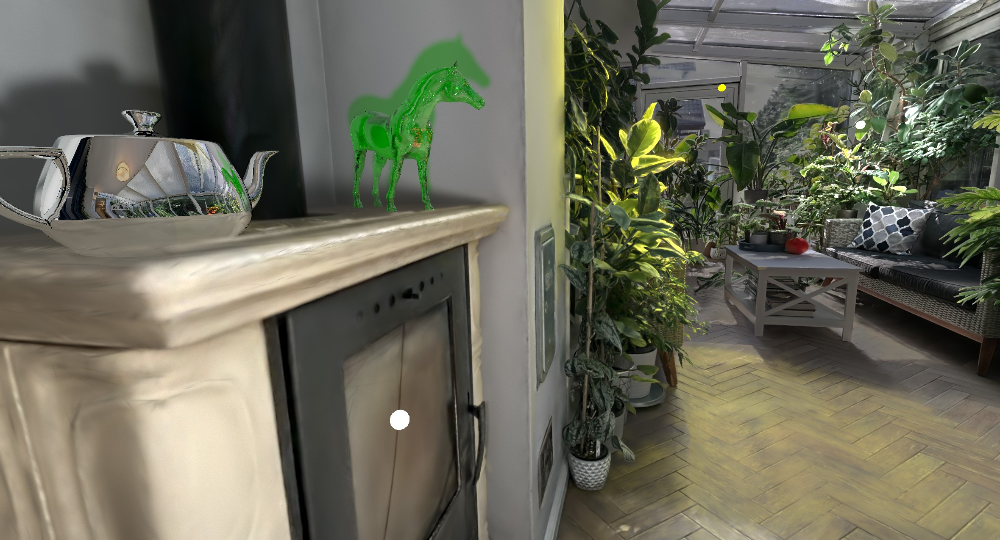

# Sample Projects Setup

The repository includes ready-to-use sample projects (`.vkgs` files) that demonstrate various features of the application. Each project combines Gaussian Splatting radiance fields with lighting, shadows, and optionally mesh assets to showcase different rendering capabilities.

## Getting the Sample Data

The sample projects reference external datasets (splat models, mesh assets) that are not bundled with the repository. A build script is provided to download all required assets automatically.

### Using the build script

From the repository root, run the following in a Linux terminal or Git Bash on Windows:

```bash
cd samples
bash build.sh
```

The script downloads all required assets into a `data/` folder next to the `.vkgs` project files. Assets that are already downloaded are skipped, so the script is safe to re-run.
You can specify an alternative destination folder:

```bash
bash build.sh /path/to/destination
```

The script will copy the `.vkgs` project files and download assets into that location.

See [samples/README.md]({{source_base}}/samples/README.md){:target="_blank"} for more information.

### Pre-built downloads

Pre-built sample data packages are not yet available. Check back for future releases that will include downloadable archives.

## Opening a Project

Once the assets are downloaded, open any `.vkgs` file using one of these methods:

- **Drag and drop** the `.vkgs` file onto the application window
- **File > Open** from the menu
- **Command line:**

```bash
./vk_gaussian_splatting samples/3dgs_large_city_sky_environment_lighting.vkgs
```

## Available Samples

<div class="grid cards" markdown>

-   

    __Large City — Sky Environment__

    ---

    A 103M-splat outdoor city scene with physical sun/sky lighting and ray traced shadows.

    [Learn more](sample-project-city-sky-env.md)

-   

    __Winter Garden - Splat Set as Light Source__

    ---

    Hybrid rendering with glTF mesh models (Teacup, Chess set) lit by the splat radiance field.

    [Learn more](sample-project-winter-garden-chess-splats-as-env.md)

-   

    __Winter Garden - Point Lights and Shadows__

    ---

    RTX ray-traced lighting and shadows on mesh objects (horse, teapot) placed in a winter garden.

    [Learn more](sample-project-winter-garden-stove-point-lights.md)

</div>
