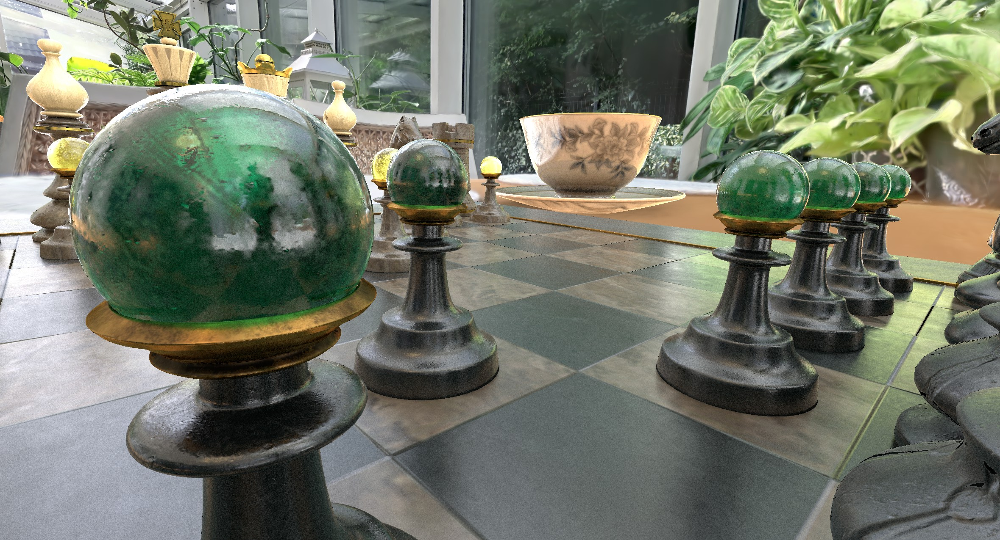

# glTF Meshes with PBR Materials Lit by Splat Set Radiance Field

**File:** `3dgs_winter_garden_chessboard_light_from_splats.vkgs`

This project places PBR glTF mesh models inside a winter garden captured as a Gaussian Splatting radiance field. The splat set acts as an environment light source, illuminating the mesh objects with the radiance stored in the trained splats. It demonstrates:

- **Pure ray tracing pipeline** (3DGRT) with the splat set used as a light source
- **Multiple glTF assets** are composited into the scene
- **Splat-based lighting** where the radiance field illuminates PBR mesh materials
- **Mesh shadow casting** between objects and onto the splat environment
- **Particle Ambient Occlusion (AO)** that shades emissive particles close to meshes

## Interacting with the scene

- Switch cameras by pressing the space bar
- Switch DLSS on and experiment with the different upscaling modes (MAX, OPTIMAL, MIN)
- Switch the rendering pipeline to Hybrid and compare performance
- Play with the visualization modes (clay mode, normals, depth, etc.)
- Explore the scene and the UI!

!!! note
    If RTX is not supported, the system will fall back to 3DGS Raster. Shadows, AO and advanced mesh materials will not show up in this mode.

## Assets

| Type | Source |
|------|--------|
| Splat model | Winter-Garden-view2 - [Andrii Shramko](https://teleportour.com) |
| Mesh models | DiffuseTransmissionTeacup, ABeautifulGame - [Khronos glTF-Sample-Assets](https://www.github.com/KhronosGroup/glTF-Sample-Assets) |
| Mesh models | Astronomical Quintant - [Virtual Museums of Małopolska](https://skfb.ly/oFrVO) |
